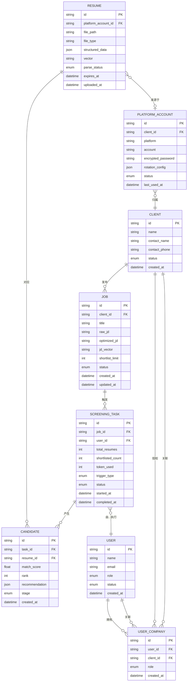
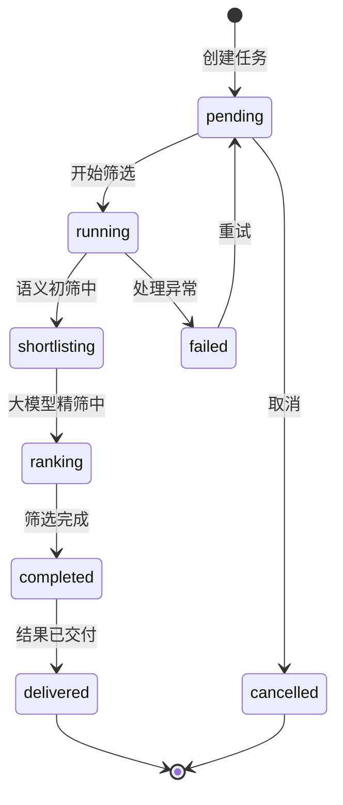
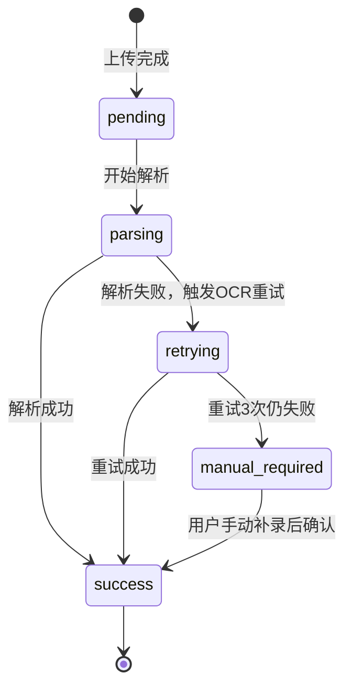

# 数据模型：AI驱动的简历筛选系统

**创建日期**：2026-04-04
**状态**：草稿

---

## 1. 实体关系图



### 实体汇总

| 实体 | 描述 | 关键属性 | 关系 |
|------|------|----------|------|
| CLIENT | 甲方客户/公司 | id, name | 拥有多个JOB、PLATFORM_ACCOUNT、USER_COMPANY |
| JOB | 招聘需求/JD | id, raw_jd, optimized_jd, jd_vector, shortlist_limit | 属于CLIENT，触发多个SCREENING_TASK |
| RESUME | 简历（原始+结构化） | id, structured_data, vector | 来源于PLATFORM_ACCOUNT，对应多个CANDIDATE |
| SCREENING_TASK | 筛选任务 | id, status, token_used, trigger_type | 属于JOB，由USER执行，产生多个CANDIDATE |
| CANDIDATE | 候选人筛选结果 | id, match_score, rank, recommendation | 属于SCREENING_TASK，对应RESUME |
| USER | 系统用户 | id, role | 执行SCREENING_TASK，通过USER_COMPANY关联多个CLIENT |
| USER_COMPANY | 用户-公司关联 | id, user_id, client_id, role | 多对多关系，用户可管理多个公司 |
| PLATFORM_ACCOUNT | 招聘平台账号 | id, platform, encrypted_password | 归属CLIENT，简历来源，目前仅支持BOSS直聘 |

---

## 2. 实体定义

### 2.1 JOB（招聘需求）

| 属性 | 类型 | 必填 | 唯一 | 默认值 | 描述 | 约束 |
|------|------|------|------|--------|------|------|
| id | string | 是 | 是 | UUID | 主键 | UUID v4 |
| client_id | string | 是 | 否 | - | 外键→CLIENT | 不可为空 |
| title | string | 是 | 否 | - | 职位名称 | 1-200字符 |
| raw_jd | text | 是 | 否 | - | 原始JD文本 | - |
| optimized_jd | text | 否 | 否 | null | AI优化后JD | - |
| jd_vector | text | 否 | 否 | null | JD向量化结果（JSON） | - |
| shortlist_limit | int | 否 | 否 | 6 | 初筛保留数量（可配置） | 1-20，默认6 |
| status | enum | 是 | 否 | active | 需求状态 | active/paused/closed |
| created_at | datetime | 是 | 否 | NOW() | 创建时间 | ISO 8601 |
| updated_at | datetime | 是 | 否 | NOW() | 更新时间 | ISO 8601 |

### 2.2 RESUME（简历）

| 属性 | 类型 | 必填 | 唯一 | 默认值 | 描述 | 约束 |
|------|------|------|------|--------|------|------|
| id | string | 是 | 是 | UUID | 主键 | UUID v4 |
| platform_account_id | string | 否 | 否 | null | 来源平台账号 | 手动上传时为null |
| file_path | string | 是 | 否 | - | 文件存储路径 | - |
| file_type | enum | 是 | 否 | - | 文件类型 | pdf/doc/docx |
| structured_data | json | 否 | 否 | null | 结构化解析结果 | 见下方结构定义 |
| vector | text | 否 | 否 | null | 简历向量化结果 | - |
| parse_status | enum | 是 | 否 | pending | 解析状态 | pending/parsing/retrying/success/manual_required |
| expires_at | datetime | 否 | 否 | +1year | 数据保留到期时间 | 到期前30天提醒，到期后脱敏归档 |
| uploaded_at | datetime | 是 | 否 | NOW() | 上传时间 | ISO 8601 |

**structured_data JSON结构**：
```json
{
  "basic_info": { "name": "", "phone": "", "email": "", "location": "" },
  "work_experience": [{ "company": "", "title": "", "duration": "", "description": "" }],
  "project_experience": [{ "name": "", "role": "", "description": "" }],
  "education": [{ "school": "", "degree": "", "major": "", "year": "" }],
  "skills": []
}
```

### 2.3 SCREENING_TASK（筛选任务）

| 属性 | 类型 | 必填 | 唯一 | 默认值 | 描述 | 约束 |
|------|------|------|------|--------|------|------|
| id | string | 是 | 是 | UUID | 主键 | UUID v4 |
| job_id | string | 是 | 否 | - | 外键→JOB | 不可为空 |
| user_id | string | 是 | 否 | - | 外键→USER | 不可为空 |
| total_resumes | int | 是 | 否 | 0 | 参与筛选简历总数 | ≥ 0 |
| shortlisted_count | int | 否 | 否 | 0 | 初筛保留数量 | 5-8 |
| token_used | int | 否 | 否 | 0 | 本次任务token消耗 | ≥ 0 |
| trigger_type | enum | 是 | 否 | manual | 触发方式 | manual/scheduled |
| status | enum | 是 | 否 | pending | 任务状态 | 见状态图 |
| started_at | datetime | 否 | 否 | null | 开始时间 | ISO 8601 |
| completed_at | datetime | 否 | 否 | null | 完成时间 | ISO 8601 |

### 2.4 CANDIDATE（候选人结果）

| 属性 | 类型 | 必填 | 唯一 | 默认值 | 描述 | 约束 |
|------|------|------|------|--------|------|------|
| id | string | 是 | 是 | UUID | 主键 | UUID v4 |
| task_id | string | 是 | 否 | - | 外键→SCREENING_TASK | 不可为空 |
| resume_id | string | 是 | 否 | - | 外键→RESUME | 不可为空 |
| match_score | float | 是 | 否 | - | 语义匹配分数 | 0.0-1.0 |
| rank | int | 否 | 否 | null | 大模型精筛排名 | 1-8 |
| recommendation | json | 否 | 否 | null | 推荐理由（结构化） | 见下方结构 |
| stage | enum | 是 | 否 | shortlisted | 候选人阶段 | shortlisted/recommended/delivered/rejected |
| created_at | datetime | 是 | 否 | NOW() | 创建时间 | ISO 8601 |

**recommendation JSON结构**：
```json
{
  "strengths": [],
  "match_points": [],
  "potential_risks": [],
  "summary": ""
}
```

### 2.5 USER（系统用户）

| 属性 | 类型 | 必填 | 唯一 | 默认值 | 描述 | 约束 |
|------|------|------|------|--------|------|------|
| id | string | 是 | 是 | UUID | 主键 | UUID v4 |
| name | string | 是 | 否 | - | 用户姓名 | 1-100字符 |
| email | string | 是 | 是 | - | 邮箱（登录账号） | 邮箱格式 |
| role | enum | 是 | 否 | consultant | 系统角色 | admin/consultant/hr |
| status | enum | 是 | 否 | active | 账号状态 | active/inactive |
| created_at | datetime | 是 | 否 | NOW() | 创建时间 | ISO 8601 |

### 2.6 CLIENT（客户/公司）

| 属性 | 类型 | 必填 | 唯一 | 默认值 | 描述 | 约束 |
|------|------|------|------|--------|------|------|
| id | string | 是 | 是 | UUID | 主键 | UUID v4 |
| name | string | 是 | 否 | - | 公司名称 | 1-200字符 |
| contact_name | string | 否 | 否 | null | 联系人姓名 | 1-100字符 |
| contact_phone | string | 否 | 否 | null | 联系电话 | 手机号格式 |
| status | enum | 是 | 否 | active | 客户状态 | active/inactive |
| created_at | datetime | 是 | 否 | NOW() | 创建时间 | ISO 8601 |

### 2.7 USER_COMPANY（用户-公司关联）

| 属性 | 类型 | 必填 | 唯一 | 默认值 | 描述 | 约束 |
|------|------|------|------|--------|------|------|
| id | string | 是 | 是 | UUID | 主键 | UUID v4 |
| user_id | string | 是 | 否 | - | 外键→USER | 不可为空 |
| client_id | string | 是 | 否 | - | 外键→CLIENT | 不可为空 |
| role | enum | 是 | 否 | member | 用户在该公司的角色 | admin/member |
| created_at | datetime | 是 | 否 | NOW() | 创建时间 | ISO 8601 |

**唯一约束**：(user_id, client_id) 组合唯一

### 2.8 PLATFORM_ACCOUNT（招聘平台账号）

| 属性 | 类型 | 必填 | 唯一 | 默认值 | 描述 | 约束 |
|------|------|------|------|--------|------|------|
| id | string | 是 | 是 | UUID | 主键 | UUID v4 |
| client_id | string | 是 | 否 | - | 外键→CLIENT | 不可为空 |
| platform | enum | 是 | 否 | boss | 平台类型 | 目前仅支持boss（BOSS直聘） |
| account | string | 是 | 否 | - | 平台账号 | 1-100字符 |
| encrypted_password | string | 是 | 否 | - | 加密后的密码 | AES-256加密 |
| rotation_config | json | 否 | 否 | null | 账号轮换配置 | 预留字段，v1.1使用 |
| status | enum | 是 | 否 | active | 账号状态 | active/inactive/expired |
| last_used_at | datetime | 否 | 否 | null | 最后使用时间 | ISO 8601 |

**唯一约束**：(client_id, platform) 组合唯一（每个公司每个平台只能绑定一个账号）

---

## 3. 状态图

### SCREENING_TASK 生命周期



### RESUME 解析状态



---

## 4. 数据约束

### 验证规则

| 约束ID | 实体 | 字段 | 规则 | 错误提示 |
|--------|------|------|------|----------|
| VAL-001 | JOB | title | 1-200字符，不可为空 | "职位名称不能为空" |
| VAL-002 | RESUME | file_type | 仅支持pdf/doc/docx | "不支持的文件格式" |
| VAL-003 | CANDIDATE | match_score | 0.0 ≤ score ≤ 1.0 | "匹配分数超出范围" |
| VAL-004 | SCREENING_TASK | shortlisted_count | 5 ≤ count ≤ 8 | "初筛保留数量应在5-8之间" |
| VAL-005 | PLATFORM_ACCOUNT | platform | 枚举值校验，MVP仅支持boss | "不支持的平台类型" |
| VAL-006 | USER_COMPANY | (user_id, client_id) | 组合唯一 | "用户已关联该公司" |
| VAL-007 | PLATFORM_ACCOUNT | (client_id, platform) | 组合唯一 | "该公司已绑定该平台账号" |

### 参照完整性

| 约束 | 父表 | 子表 | 删除策略 |
|------|------|------|----------|
| FK_job_client | CLIENT | JOB | RESTRICT（客户有JD时不可删除） |
| FK_task_job | JOB | SCREENING_TASK | RESTRICT |
| FK_candidate_task | SCREENING_TASK | CANDIDATE | CASCADE |
| FK_candidate_resume | RESUME | CANDIDATE | RESTRICT |
| FK_user_company_user | USER | USER_COMPANY | CASCADE |
| FK_user_company_client | CLIENT | USER_COMPANY | CASCADE |
| FK_platform_account_client | CLIENT | PLATFORM_ACCOUNT | CASCADE |

---

## 5. 数据量估算

| 实体 | 初始量 | 月增长 | 1年预估 | 单条大小 |
|------|--------|--------|---------|----------|
| CLIENT | 50 | +20/月 | 290 | ~1 KB |
| JOB | 200 | +100/月 | 1,400 | ~10 KB |
| RESUME | 5,000 | +3,000/月 | 41,000 | ~50 KB |
| SCREENING_TASK | 500 | +300/月 | 4,100 | ~2 KB |
| CANDIDATE | 3,000 | +2,000/月 | 27,000 | ~5 KB |
| USER | 20 | +10/月 | 140 | ~1 KB |
| USER_COMPANY | 100 | +50/月 | 700 | ~0.5 KB |
| PLATFORM_ACCOUNT | 50 | +20/月 | 290 | ~1 KB |

---

## 6. 数据字典

### 枚举类型

#### JOB.status
| 值 | 标签 | 描述 |
|----|------|------|
| active | 进行中 | 需求正在招聘 |
| paused | 暂停 | 临时暂停招聘 |
| closed | 已关闭 | 招聘结束 |

#### SCREENING_TASK.status
| 值 | 标签 | 描述 |
|----|------|------|
| pending | 待开始 | 任务已创建，等待执行 |
| running | 执行中 | 正在处理 |
| shortlisting | 初筛中 | embedding向量化匹配阶段 |
| ranking | 精筛中 | 大模型二次评判阶段 |
| completed | 已完成 | 筛选结果已生成 |
| delivered | 已交付 | 结果已推送给甲方 |
| failed | 失败 | 处理异常 |
| cancelled | 已取消 | 用户取消 |

#### PLATFORM_ACCOUNT.platform
| 值 | 标签 | MVP支持 |
|----|------|---------|
| boss | BOSS直聘 | ✅ |
| liepin | 猎聘 | v1.1 |
| lagou | 拉钩 | v1.1 |
| zhilian | 智联招聘 | v1.1 |
| other | 其他 | v1.1 |

#### USER_COMPANY.role
| 值 | 标签 | 描述 |
|----|------|------|
| admin | 管理员 | 可管理公司配置和用户权限 |
| member | 成员 | 普通成员，可使用公司资源 |

---

## 7. 需求追溯

| 实体 | 来源需求 | 用户故事 |
|------|----------|----------|
| CLIENT | REQ-010, REQ-007-1 | US-014, US-015 |
| JOB | REQ-011, REQ-004 | US-001, US-002, US-003 |
| RESUME | REQ-001, REQ-005, REQ-006 | US-004, US-005, US-007, US-008 |
| SCREENING_TASK | REQ-002, REQ-003, REQ-014 | US-009, US-010, US-017 |
| CANDIDATE | REQ-003, REQ-009 | US-010, US-012 |
| USER | REQ-010, REQ-007-1 | US-014, US-015 |
| USER_COMPANY | REQ-007-1 | US-015 |
| PLATFORM_ACCOUNT | REQ-005, REQ-007, REQ-007-2 | US-005, US-006, US-016 |
