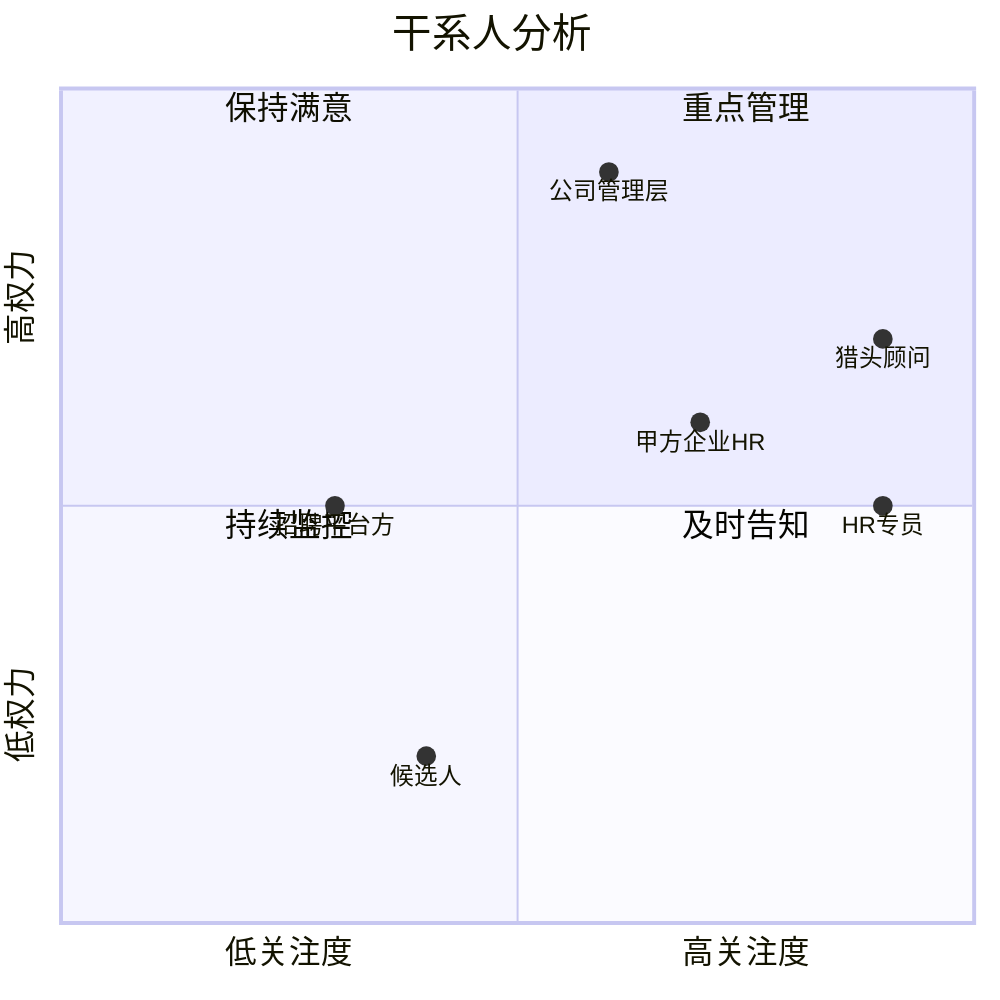
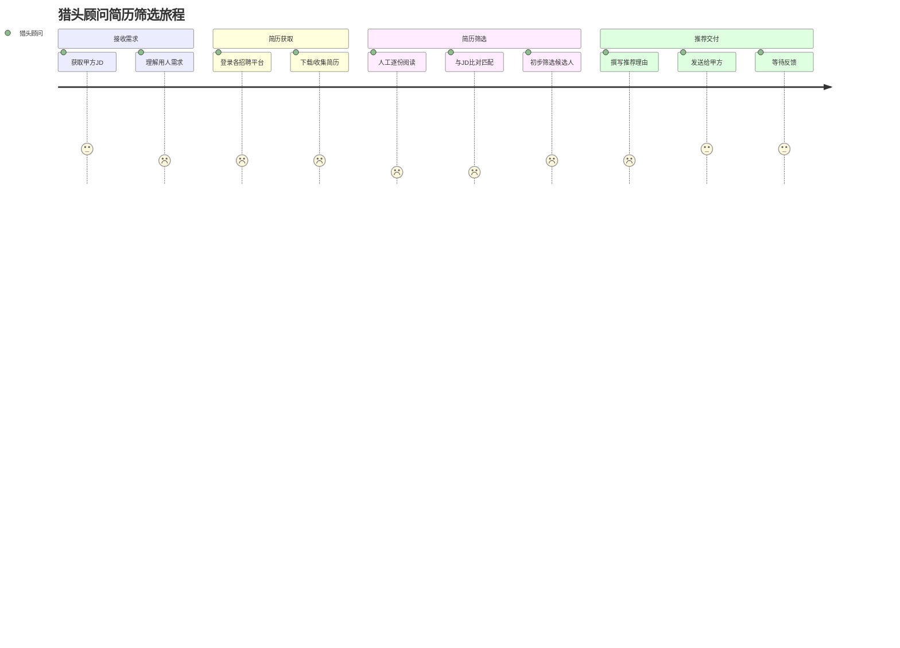

# 需求发现：AI驱动的简历筛选系统

**创建日期**：2026-04-04
**状态**：已完成

---

## 1. 项目概述

**项目名称**：HR智能体 — AI驱动简历筛选系统

**业务背景**：
面向猎头/RPO机构（优先服务公司自身人力U盾中小企业RPO业务），解决招聘流程中匹配精度低、简历筛选重复低效、JD撰写不规范、招聘合规等核心痛点。核心AI逻辑已验证，当前阶段重点为前端UI与交互开发。

**项目目标**：
- 第一阶段：标准化轻量工具，提升HR/猎头筛选效率，降低重复劳动
- 第二阶段：沉淀垂直简历库，打造垂直细分招聘平台，对外商业化

---

## 2. 干系人分析

### 权力-利益矩阵

### 干系人列表

| 角色 | 权力 | 关注度 | 策略 | 备注 |
|------|------|--------|------|------|
| 公司管理层 | 高 | 中 | 重点管理 | 决定产品方向与投入 |
| 猎头顾问 | 高 | 高 | 重点管理 | 核心用户，直接使用筛选结果 |
| HR专员（RPO） | 中 | 高 | 重点管理 | 日常操作用户，管理多客户需求 |
| 甲方企业HR | 中 | 高 | 及时告知 | 接收推荐结果的最终客户 |
| 候选人 | 低 | 低 | 持续监控 | 间接受影响方 |
| 招聘平台方 | 中 | 低 | 保持满意 | BOSS直聘、猎聘、拉钩等API合作方 |

---

## 3. 用户画像

### 画像一：猎头顾问（核心用户）

| 属性 | 描述 |
|------|------|
| 角色 | 猎头顾问 / RPO招聘专员 |
| 目标 | 快速从大量简历中筛出3份高质量候选人推荐给甲方 |
| 痛点 | 手动筛选200+份简历耗时耗力；JD与简历匹配标准不统一；多平台账号管理混乱 |
| 技术熟练度 | 初级～中级 |
| 使用场景 | PC端为主，需同时管理多个客户的招聘需求 |

**代表性引语**：「每次收到一个职位，光看简历就要花半天，还不一定选得准。」

---

### 画像二：HR专员（RPO业务）

| 属性 | 描述 |
|------|------|
| 角色 | 公司内部HR / RPO项目负责人 |
| 目标 | 管理多个甲方客户的招聘需求，确保交付质量和合规性 |
| 痛点 | JD质量参差不齐，需反复沟通对齐；结果交付依赖人工，效率低 |
| 技术熟练度 | 中级 |
| 使用场景 | PC端 + 企业微信，需要自动化交付结果 |

**代表性引语**：「甲方给的JD经常写得很模糊，我们要花很多时间去对齐用人需求。」

---

### 画像三：甲方企业HR（结果接收方）

| 属性 | 描述 |
|------|------|
| 角色 | 甲方公司HR负责人 |
| 目标 | 收到精准的候选人推荐，减少面试轮次 |
| 痛点 | 收到的推荐简历质量不稳定；缺乏推荐理由说明 |
| 技术熟练度 | 初级 |
| 使用场景 | 企业微信接收推荐结果 |

**代表性引语**：「希望每次推过来的人都是真正符合要求的，不要让我再筛一遍。」

---

## 4. 用户旅程地图

### 旅程详情

| 阶段 | 用户行为 | 心理状态 | 痛点 | 机会点 |
|------|----------|----------|------|--------|
| 接收需求 | 获取JD，与甲方沟通对齐 | 😐 不确定 | JD不规范，需反复确认 | AI辅助优化JD、自动对齐用人需求 |
| 简历获取 | 登录多平台，手动下载简历 | 😞 繁琐 | 多账号管理混乱，部分平台无API | 统一多平台账号管理，AI浏览器自动获取 |
| 简历筛选 | 逐份阅读，人工比对JD | 😞 低效 | 耗时长，标准不统一，易遗漏 | 结构化切片+向量初筛+大模型精筛 |
| 推荐交付 | 撰写推荐理由，通过微信发送 | 😊 完成 | 推荐理由撰写耗时 | 自动生成排序和推荐理由，企业微信自动交付 |

---

## 5. 竞品分析

| 功能维度 | 本产品（规划） | 传统ATS（北森/Moka） | 招聘平台内置筛选（BOSS直聘） | 通用AI工具（ChatGPT等） |
|----------|--------------|---------------------|---------------------------|------------------------|
| 简历结构化解析 | ✅ 规划 | ✅ 有 | ✅ 有 | ⚠️ 需手动输入 |
| JD-简历语义匹配 | ✅ 规划（embedding+大模型） | ⚠️ 关键词匹配为主 | ⚠️ 关键词匹配为主 | ⚠️ 无自动化 |
| 二次精准排序+推荐理由 | ✅ 规划 | ❌ 无 | ❌ 无 | ⚠️ 需手动操作 |
| 多平台简历获取 | ✅ 规划（API+AI浏览器） | ❌ 无 | ❌ 仅本平台 | ❌ 无 |
| 多客户多需求管理 | ✅ 规划 | ✅ 有 | ❌ 无 | ❌ 无 |
| 企业微信自动交付 | ✅ 规划 | ❌ 无 | ❌ 无 | ❌ 无 |
| AI辅助JD优化 | ✅ 规划 | ❌ 无 | ❌ 无 | ⚠️ 需手动操作 |
| 成本控制（token优化） | ✅ 核心优势（1/50消耗） | N/A | N/A | ❌ 无优化 |

### 差异化机会点
1. 「正反翻译匹配」+ 向量初筛 + 大模型精筛的三层漏斗，兼顾精度与成本，是核心技术壁垒
2. 多平台简历自动获取（含无API平台），解决猎头/RPO最头疼的数据来源问题
3. 企业微信自动交付 + 保留人工后端，在自动化效率与服务温度之间取得平衡
4. 垂直简历库沉淀，是第二阶段构建平台护城河的关键

---

## 6. 原始需求清单

| ID | 需求描述 | 来源 | 优先级 | 备注 |
|----|----------|------|--------|------|
| REQ-001 | 支持Word/PDF等多格式简历解析与结构化 | 技术方案 | 高 | 按模块切片 |
| REQ-002 | JD与简历的语义匹配评分（embedding向量化） | 技术方案 | 高 | 初筛阶段 |
| REQ-003 | 大模型二次精筛，输出排序和推荐理由 | 技术方案 | 高 | 最终保留5-8份→推荐3份 |
| REQ-004 | 从简历反向生成对应JD（正反翻译匹配） | 技术方案 | 高 | 提升匹配精度 |
| REQ-005 | 对接有API的头部招聘平台（BOSS直聘/猎聘/拉钩） | 技术方案 | 高 | 官方API接入 |
| REQ-006 | AI浏览器自动获取无API平台简历 | 技术方案 | 中 | 技术难点，存在对抗风险 |
| REQ-007 | 多账号管理（按客户/平台分类，支持自动轮换登录） | 技术方案 | 中 | 适配猎头/RPO多客户场景 |
| REQ-008 | 小程序/PC双端前端入口 | 产品要求 | 高 | 第一阶段重点 |
| REQ-009 | 企业微信自动交付筛选结果 | 产品要求 | 高 | 保留服务温度 |
| REQ-010 | 支持多客户多招聘需求管理 | 产品要求 | 高 | 猎头/RPO核心场景 |
| REQ-011 | AI辅助优化不规范JD，对齐用人需求 | 产品要求 | 高 | 减少沟通成本 |
| REQ-012 | 保留人工后端对接能力 | 产品要求 | 中 | 保留服务温度 |
| REQ-013 | 中文场景优先使用国内大模型，出海场景使用海外模型 | 技术方案 | 中 | 模型路由策略 |
| REQ-014 | token消耗优化（目标：全流程大模型方案的1/50） | 技术方案 | 高 | 成本控制核心指标 |
| REQ-015 | 第二阶段：垂直简历库沉淀与平台化 | 商业模式 | 低（当前阶段） | 未来规划 |

---

## 7. 核心痛点总结

1. 匹配精度低：关键词匹配无法理解语义，导致筛选结果质量不稳定
2. 简历筛选重复低效：人工逐份阅读200+份简历，耗时且标准不统一
3. JD撰写不规范：甲方JD质量参差不齐，需大量沟通成本对齐用人需求
4. 多平台数据获取困难：各平台账号分散，部分平台无API，获取成本高
5. 交付流程依赖人工：推荐结果需手动整理和发送，效率低
6. 成本控制压力：全流程大模型处理token消耗高，商业化难以规模化

---

## 下一步

- [ ] 进入第二阶段：价值排序（MoSCoW + RICE评分，确定MVP范围）
