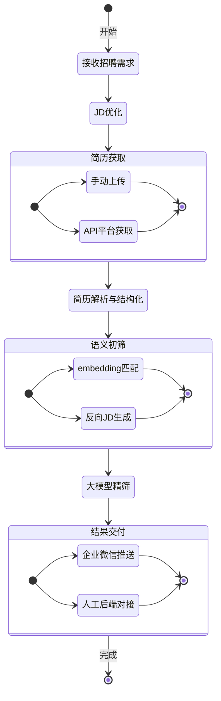
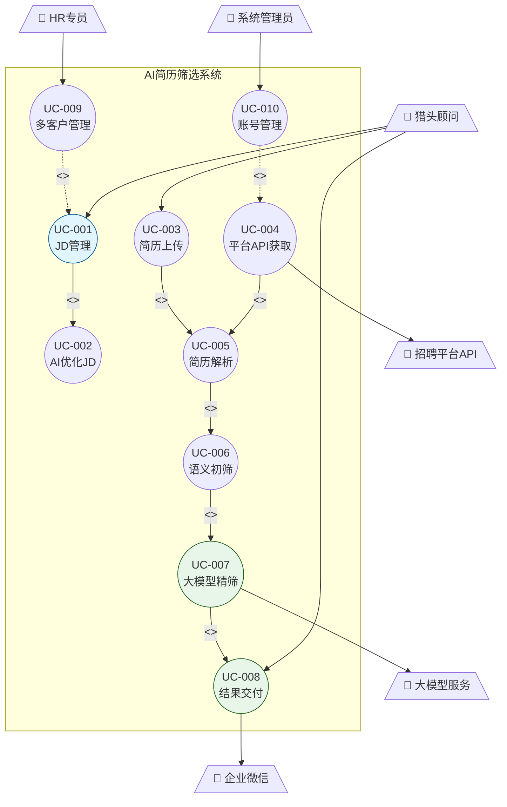
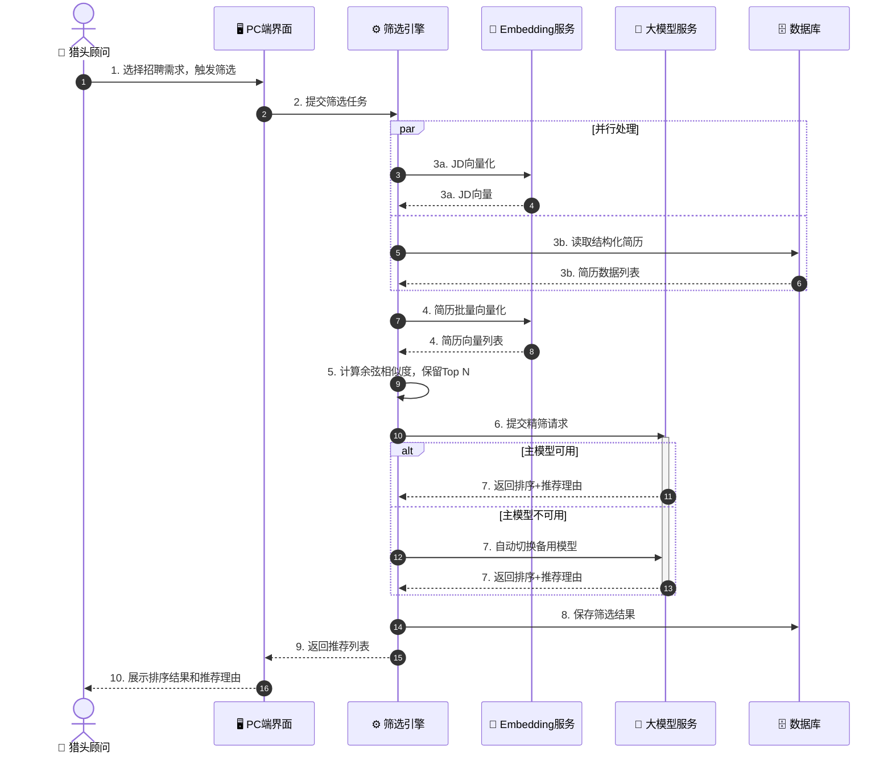
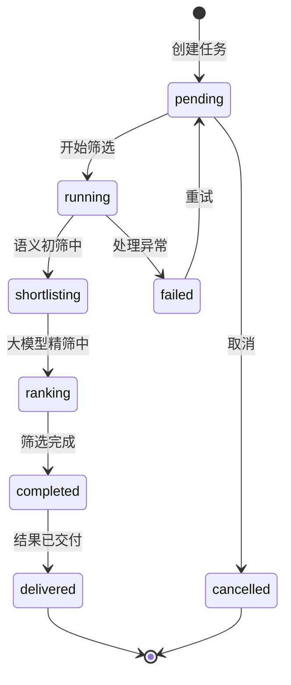
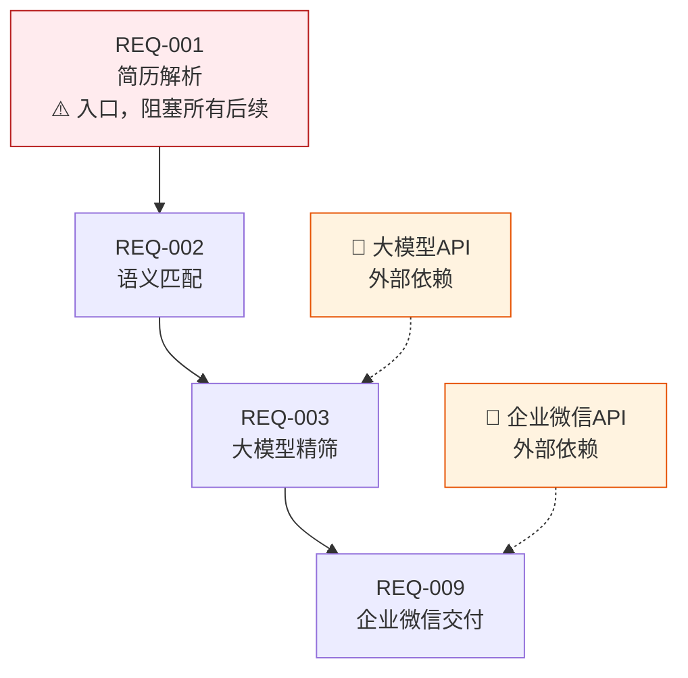
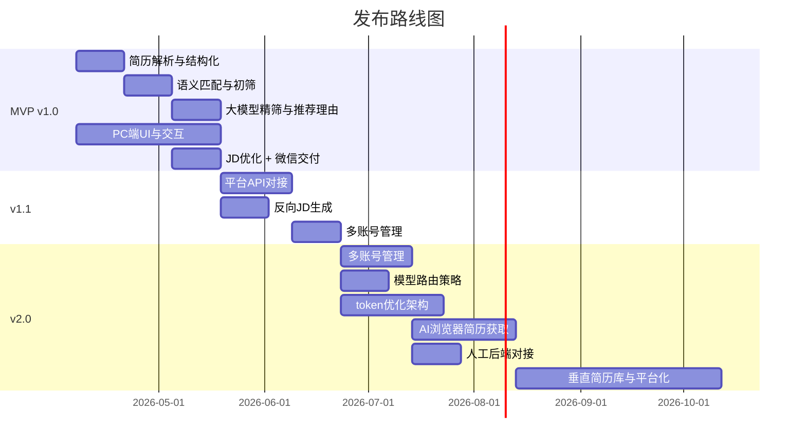

# 产品需求文档（PRD）

# HR智能体 — AI驱动的简历筛选系统

---

## 文档信息

| 字段 | 值 |
|------|-----|
| **产品名称** | HR智能体 — AI驱动简历筛选系统 |
| **版本** | v1.0.0 |
| **创建日期** | 2026-04-04 |
| **最后更新** | 2026-04-04 |
| **负责人** | 产品团队 |
| **状态** | 已审核，有条件通过 |
| **基线版本** | v1.0.0 |

### 文档历史

| 版本 | 日期 | 作者 | 变更内容 | 审批人 |
|------|------|------|----------|--------|
| 0.1 | 2026-04-04 | 需求分析师 | 初稿（基于会议纪要） | - |
| 1.0 | 2026-04-04 | 需求分析师 | 完成六阶段分析，建立基线 | 产品负责人、技术负责人 |

### 关联文档

| 文档 | 路径 | 描述 |
|------|------|------|
| 需求发现 | `.kiro/specs/ai-resume-screening/discovery.md` | 干系人分析、用户画像、竞品分析 |
| 价值排序 | `.kiro/specs/ai-resume-screening/sort.md` | MoSCoW、RICE评分、发布计划 |
| 需求分析 | `.kiro/specs/ai-resume-screening/requirements.md` | 用户故事、用例、数据模型 |
| 数据模型 | `.kiro/specs/ai-resume-screening/data-model.md` | 实体关系图、状态图 |
| 需求澄清 | `.kiro/specs/ai-resume-screening/clarification.md` | 8轮澄清决策记录 |
| 需求验证 | `.kiro/specs/ai-resume-screening/validation.md` | 五维验证报告 |
| 需求追溯 | `.kiro/specs/ai-resume-screening/rtm.md` | 需求追溯矩阵 |
| 交互原型 | `.kiro/specs/ai-resume-screening/prototype/` | 静态HTML原型 |

---

## 1. 执行摘要

### 1.1 概述

HR智能体是一款面向猎头顾问和RPO机构的AI驱动简历筛选工具，旨在解决招聘流程中匹配精度低、简历筛选重复低效、JD撰写不规范等核心痛点。系统采用"结构化切片 + embedding语义初筛 + 大模型精筛"三层漏斗架构，将token消耗降至全流程大模型方案的1/50，同时保持高匹配精度。

第一阶段以轻量化PC端工具为主，打通从JD输入到企业微信自动交付的完整闭环，优先服务公司自身人力U盾中小企业RPO业务。第二阶段沉淀垂直简历库，向垂直细分招聘平台演进，实现对外商业化。

核心AI逻辑已完成验证，当前阶段重点为前端UI与交互开发。

### 1.2 关键信息

| 方面 | 摘要 |
|------|------|
| 目标用户 | 猎头顾问、HR专员（RPO）、甲方企业HR |
| 核心价值 | 将200份简历筛选时间从半天压缩至5分钟，成本降至1/50 |
| MVP范围 | 简历解析、语义初筛、大模型精筛、PC端UI、JD优化、企业微信交付 |
| 发布计划 | MVP约6周，v1.1约5周，v2.0约3个月 |
| 核心KPI | 筛选耗时<5分钟，猎头满意度≥70%，token消耗≤1/50 |

### 1.3 验证状态

| 维度 | 得分 | 状态 |
|------|------|------|
| 真实性 | 88% | ✅ |
| 完整性 | 91% | ✅ |
| 一致性 | 96% | ✅ |
| 可行性 | 78% | ⚠️ |
| 可验证性 | 82% | ⚠️ |

---

## 2. 产品概述

### 2.1 产品愿景

成为猎头/RPO机构首选的AI招聘效率工具，通过技术手段将简历筛选从"人力密集型"转变为"AI辅助型"，最终沉淀垂直简历库，构建垂直细分招聘平台。

### 2.2 问题陈述

| 方面 | 描述 |
|------|------|
| 现状 | 猎头顾问需手动阅读200+份简历，耗时半天以上，标准不统一 |
| 痛点 | 匹配精度低、筛选重复低效、JD不规范、多平台账号管理混乱、交付依赖人工 |
| 影响 | 猎头效率低下，RPO业务难以规模化，甲方满意度不稳定 |
| 证据 | 会议纪要（2026-03-27）：核心AI逻辑已验证，token消耗仅为常规方案的1% |

### 2.3 产品目标

| ID | 目标 | 成功指标 | 目标值 | 测量方式 |
|----|------|----------|--------|----------|
| OBJ-001 | 提升筛选效率 | 200份简历筛选耗时 | <5分钟 | 系统日志统计 |
| OBJ-002 | 控制AI成本 | token消耗 vs 全流程大模型方案 | ≤1/50 | 监控统计 |
| OBJ-003 | 提升推荐质量 | 猎头对推荐结果满意度 | ≥70% | 用户反馈 |
| OBJ-004 | 自动化交付 | 企业微信推送成功率 | ≥99% | 监控告警 |
| OBJ-005 | 系统稳定性 | 月可用性SLA | ≥99.5% | 监控统计 |

### 2.4 范围定义

#### 纳入范围

| ID | 功能/能力 | 版本 | 优先级 |
|----|-----------|------|--------|
| S-001 | 多格式简历解析与结构化 | MVP | P0 |
| S-002 | JD语义匹配评分（embedding初筛） | MVP | P0 |
| S-003 | 大模型二次精筛+推荐理由 | MVP | P0 |
| S-004 | PC端基础UI与交互 | MVP | P0 |
| S-005 | AI辅助优化JD | MVP | P0 |
| S-006 | 企业微信自动交付（卡片+PDF） | MVP | P0 |
| S-007 | 多客户多需求管理（基础） | MVP | P0 |
| S-007-1 | 用户-公司权限管理（一个用户管理多个公司） | MVP | P0 |
| S-007-2 | BOSS直聘账号绑定（每个公司绑定账号） | MVP | P0 |
| S-008 | 从简历反向生成JD | v1.1 | P1 |
| S-009 | 招聘平台API对接（多平台） | v1.1 | P1 |
| S-010 | 多账号管理（多平台账号轮换） | v1.1 | P1 |
| S-011 | AI浏览器获取无API平台简历 | v2.0 | P2 |
| S-012 | 人工后端对接 | v2.0 | P2 |
| S-013 | 模型路由策略 | v2.0 | P2 |
| S-014 | token消耗监控与优化 | v2.0 | P2 |
| S-015 | 垂直简历库与平台化 | v2.0 | P2 |

#### 假设

| ID | 假设 | 若假设错误的影响 | 验证状态 |
|----|------|-----------------|----------|
| A-001 | 核心AI逻辑（embedding+大模型精筛）已验证可用 | 影响MVP核心价值 | 已验证 |
| A-002 | 目标用户（猎头/RPO）有PC端使用习惯 | 需调整前端策略 | 待验证 |
| A-003 | 甲方企业已开通企业微信 | 需提供备用交付方式 | 待验证 |
| A-004 | OCR重试上限3次足够覆盖大多数扫描版简历 | 可通过配置调整 | 低风险 |
| A-005 | 简历数据默认保留1年符合业务需求 | 需与法务确认 | 待验证 |

#### 约束

| ID | 约束 | 类型 | 影响 |
|----|------|------|------|
| C-001 | 候选人数据需符合《个人信息保护法》 | 法规 | 需设计授权机制 |
| C-002 | AI浏览器方案可能违反招聘平台ToS | 法规 | REQ-006需法务审查 |
| C-003 | 大模型API依赖外部服务，需备用方案 | 技术 | 已设计主备切换 |


---

## 3. 用户分析

### 3.1 用户画像

#### 画像一：猎头顾问（核心用户）

| 属性 | 描述 |
|------|------|
| 角色 | 猎头顾问 / RPO招聘专员 |
| 目标 | 快速从大量简历中精准筛出3份推荐给甲方 |
| 痛点 | 手动筛选耗时、多平台账号混乱、推荐理由撰写费时 |
| 技术熟练度 | 初级～中级 |
| 使用场景 | PC端，同时管理多个客户的招聘需求 |

**代表性引语**：「每次收到一个职位，光看简历就要花半天，还不一定选得准。」

#### 画像二：HR专员（RPO）

| 属性 | 描述 |
|------|------|
| 角色 | 公司内部HR / RPO项目负责人 |
| 目标 | 管理多个甲方客户的招聘需求，确保交付质量 |
| 痛点 | JD质量参差不齐，结果交付依赖人工 |
| 技术熟练度 | 中级 |
| 使用场景 | PC端 + 企业微信，需要自动化交付 |

**代表性引语**：「甲方给的JD经常写得很模糊，我们要花很多时间去对齐用人需求。」

#### 画像三：甲方企业HR（结果接收方）

| 属性 | 描述 |
|------|------|
| 角色 | 甲方公司HR负责人 |
| 目标 | 收到精准推荐，减少面试轮次 |
| 痛点 | 推荐简历质量不稳定，缺乏推荐理由 |
| 技术熟练度 | 初级 |
| 使用场景 | 企业微信接收推荐结果 |

### 3.2 核心用户活动流



---

## 4. 功能需求

### 4.1 需求汇总

| 需求ID | 需求描述 | 优先级 | 版本 | 状态 |
|--------|----------|--------|------|------|
| REQ-001 | 多格式简历解析与结构化（Word/PDF） | P0 | MVP | 已验证 |
| REQ-002 | JD与简历语义匹配评分（embedding初筛） | P0 | MVP | 已验证 |
| REQ-003 | 大模型二次精筛，输出排序和推荐理由 | P0 | MVP | 已验证 |
| REQ-004 | 从简历反向生成JD | P1 | v1.1 | 已验证 |
| REQ-005 | 对接有API的头部招聘平台 | P1 | v1.1 | 已验证 |
| REQ-005-1 | BOSS直聘平台API对接（MVP范围） | P0 | MVP | 已验证 |
| REQ-006 | AI浏览器自动获取无API平台简历 | P2 | v2.0 | ⚠️ 需POC |
| REQ-007 | 多账号管理（按客户/平台分类） | P1 | v1.1 | 已验证 |
| REQ-007-1 | 用户-公司权限管理（一个用户管理多个公司） | P0 | MVP | 已验证 |
| REQ-007-2 | BOSS直聘账号绑定（每个公司绑定账号） | P0 | MVP | 已验证 |
| REQ-008 | PC端前端入口（基础UI与交互） | P0 | MVP | 已验证 |
| REQ-009 | 企业微信自动交付（卡片+PDF附件） | P0 | MVP | 已验证 |
| REQ-010 | 多客户多招聘需求管理 | P0 | MVP | 已验证 |
| REQ-011 | AI辅助优化不规范JD | P0 | MVP | 已验证 |
| REQ-012 | 保留人工后端对接能力 | P2 | v2.0 | 已验证 |
| REQ-013 | 模型路由策略（中文/出海） | P2 | v2.0 | 已验证 |
| REQ-014 | token消耗监控与优化 | P2 | v2.0 | 已验证 |
| REQ-015 | 垂直简历库沉淀与平台化 | P2 | v2.0 | 已验证 |

### 4.2 用户故事地图

| 活动 | MVP (P0) | v1.1 (P1) | v2.0 (P2) |
|------|----------|-----------|-----------|
| JD管理 | US-001, US-002 | US-003 | - |
| 简历获取 | US-004 | US-005, US-006 | US-007 |
| 简历筛选 | US-008, US-009, US-010 | - | US-011 |
| 结果交付 | US-012 | - | US-013 |
| 多客户管理 | US-014, US-015 | US-016 | - |
| 系统配置 | US-019 | - | US-017, US-018 |

### 4.3 功能模块：简历筛选核心流程

#### 4.3.1 概述

三层漏斗架构：结构化解析 → embedding语义初筛 → 大模型精筛。核心AI逻辑已验证，token消耗仅为全流程大模型方案的1/50。

#### 4.3.2 用户故事

##### US-008：简历结构化解析

| 属性 | 值 |
|------|-----|
| 优先级 | P0 |
| 角色 | 猎头顾问 |
| 版本 | MVP |

> 作为猎头顾问，我希望系统自动将不同格式的简历解析为标准结构，以便后续进行统一的匹配和比较。

```gherkin
Scenario: 简历结构化解析成功
  Given 上传了Word或PDF格式的简历
  When 系统完成解析
  Then 简历被切片为：基本信息、工作经历、项目经历、教育背景、技能
  And 每个字段有明确的结构化数据

Scenario: 解析失败自动重试
  Given 上传了扫描版PDF等难以解析的简历
  When 首次解析失败
  Then 系统自动调用OCR服务重试，最多重试3次
  And 重试成功则正常进入筛选池

Scenario: 多次重试仍失败
  Given 简历经过3次OCR重试仍无法解析
  Then 系统将该简历标记为"需人工处理"
  And 在界面上单独列出，提示用户手动补录关键信息
  And 用户补录完成后可手动将其重新加入筛选池
```

##### US-009：语义匹配初筛

| 属性 | 值 |
|------|-----|
| 优先级 | P0 |
| 角色 | 猎头顾问 |
| 版本 | MVP |

> 作为猎头顾问，我希望系统通过语义匹配自动对简历评分并初步筛选，以便从大量简历中快速缩小候选范围。

```gherkin
Scenario: 手动触发筛选
  Given 已有结构化简历和优化后的JD
  When 猎头顾问点击"开始筛选"按钮
  Then 系统使用embedding向量化计算匹配分数
  And 按分数排序，保留前N份候选人（N由该需求的shortlist_limit配置，默认6）
  And 每份简历显示匹配分数和匹配维度说明
  And 200份简历的初筛耗时不超过5分钟

Scenario: 定时自动触发筛选
  Given 招聘需求已配置定时筛选规则（频率+时间窗口）
  And 简历池中有新增简历
  When 到达配置的触发时间
  Then 系统自动创建筛选任务并执行
  And 完成后同时发送系统内站内消息和企业微信通知给猎头顾问
  And 两个渠道均记录通知状态（已发送/已读）
  And 任务记录中标注触发方式为"定时自动"
```

##### US-010：大模型精筛与推荐理由

| 属性 | 值 |
|------|-----|
| 优先级 | P0 |
| 角色 | 猎头顾问 |
| 版本 | MVP |

> 作为猎头顾问，我希望系统对初筛结果进行大模型二次评判并生成推荐理由，以便直接将结果交付给甲方。

```gherkin
Scenario: 大模型精筛
  Given 初筛保留了N份候选人
  When 系统调用大模型进行二次评判
  Then 输出候选人排序（第1-3名）
  And 每位候选人附带结构化推荐理由（优势、匹配点、潜在风险）
  And token消耗不超过全流程大模型方案的1/50

Scenario: 主模型不可用时自动切换
  Given 主大模型API不可用（限流或宕机）
  When 系统检测到调用失败
  Then 自动切换到备用模型，用户无感知
  And 任务记录中标注实际使用的模型
```

##### US-012：企业微信自动交付

| 属性 | 值 |
|------|-----|
| 优先级 | P0 |
| 角色 | 猎头顾问 |
| 版本 | MVP |

> 作为猎头顾问，我希望筛选结果自动推送到企业微信，以便甲方及时收到推荐，减少人工发送步骤。

```gherkin
Scenario: 企业微信自动推送
  Given 大模型精筛已完成
  When 猎头顾问确认推送
  Then 系统通过企业微信API发送结构化消息卡片
  And 卡片包含：候选人姓名、匹配分数、推荐理由摘要
  And 同时附带候选人简历PDF附件
  And 发送成功后记录交付时间和接收方
  And 若PDF发送失败，卡片中提供简历下载链接作为降级方案
```

#### 4.3.3 业务规则

| 规则ID | 规则描述 | 来源 | 例外 |
|--------|----------|------|------|
| BR-001 | 初筛保留数量（shortlist_limit）默认为6，范围1-20，每个招聘需求可单独配置 | Q2澄清 | 无 |
| BR-002 | 简历解析失败时先自动OCR重试，最多3次，全部失败后标记为"需人工处理" | Q4澄清 | 无 |
| BR-003 | 大模型主模型不可用时自动切换备用模型，用户无感知 | Q5澄清 | 无 |
| BR-004 | 企业微信推送同时发送结构化卡片和PDF附件，PDF失败时降级为下载链接 | Q3澄清 | 无 |
| BR-005 | 定时筛选完成后同时发送站内消息和企业微信通知 | Q7澄清 | 无 |
| BR-006 | 简历数据默认保留1年，到期前30天提醒，到期后自动脱敏归档 | Q8澄清 | 用户可申请延期 |
| BR-007 | 多客户数据采用数据库行级安全策略（RLS），严格防止跨客户数据访问 | Q6澄清 | 无 |
| BR-008 | 用户可管理多个公司，登录后可切换当前工作公司，所有数据按公司隔离 | 新增 | 无 |
| BR-009 | 每个公司可绑定一个BOSS直聘账号，账号密码使用AES-256加密存储 | 新增 | 无 |


---

## 5. 用例

### 5.1 用例图



### 5.2 核心用例：UC-007 大模型精筛主流程



---

## 6. 领域模型

### 6.1 实体关系图

```mermaid
erDiagram
    CLIENT ||--o{ JOB : "发布"
    JOB ||--o{ SCREENING_TASK : "触发"
    SCREENING_TASK ||--o{ CANDIDATE : "产生"
    RESUME ||--o{ CANDIDATE : "对应"
    SCREENING_TASK }o--|| USER : "由...执行"
    PLATFORM_ACCOUNT }o--|| CLIENT : "归属"
    RESUME }o--o| PLATFORM_ACCOUNT : "来源于"

    CLIENT { string id PK; string name; enum status }
    JOB { string id PK; string client_id FK; string title; string optimized_jd; int shortlist_limit; enum status }
    RESUME { string id PK; json structured_data; enum parse_status; datetime expires_at }
    SCREENING_TASK { string id PK; string job_id FK; int token_used; enum trigger_type; enum status }
    CANDIDATE { string id PK; string task_id FK; float match_score; int rank; json recommendation }
    USER { string id PK; string email; enum role }
    PLATFORM_ACCOUNT { string id PK; string platform; string encrypted_password }
```

### 6.2 SCREENING_TASK 状态图



---

## 7. 非功能性需求

### 7.1 性能需求

| ID | 需求 | 指标 | 目标 | 测量方式 |
|----|------|------|------|----------|
| NFR-P01 | 简历初筛响应 | 200份简历处理时间 | <5分钟 | 自动化测试 |
| NFR-P02 | JD优化响应 | 接口响应时间 | <30秒 | 接口测试 |
| NFR-P03 | 页面加载 | 4G网络下首屏FCP | <2秒 | Lighthouse |
| NFR-P04 | token消耗 | vs 全流程大模型方案 | ≤1/50 | 监控统计 |

### 7.2 可靠性需求

| ID | 需求 | 指标 | 目标 | 测量方式 |
|----|------|------|------|----------|
| NFR-R01 | 系统可用性 | 月可用性SLA | ≥99.5% | 监控统计（按月统计） |
| NFR-R02 | 大模型服务降级 | 备用方案 | 主模型不可用时自动切换备用，用户无感知 | 故障演练 |
| NFR-R03 | 数据备份 | 备份频率 | 每日全量备份 | 备份验证 |

### 7.3 安全需求

| ID | 需求 | 指标 | 目标 | 关联需求 |
|----|------|------|------|----------|
| NFR-S01 | 账号密码存储 | 加密方式 | AES-256加密 | REQ-007 |
| NFR-S02 | 数据传输 | 传输加密 | TLS 1.3 | 全部 |
| NFR-S03 | 简历数据隐私 | 数据保留策略 | 默认保留1年,到期前30天提醒，到期后自动脱敏归档 | REQ-015 |
| NFR-S04 | 访问控制 | 权限隔离 | 数据库行级安全策略（RLS），严格防止跨客户数据访问 | REQ-010 |
| NFR-S05 | BOSS直聘账号安全 | 密码加密 | AES-256加密存储 | REQ-007-2 |

### 7.4 兼容性需求

| ID | 需求 | 指标 | 目标 | 关联需求 |
|----|------|------|------|----------|
| NFR-C01 | 浏览器支持 | 主流浏览器 | Chrome/Edge/Safari最新两个版本 | REQ-008 |
| NFR-C02 | 简历格式 | 支持格式 | Word（.doc/.docx）、PDF | REQ-001 |
| NFR-C03 | 企业微信版本 | 兼容版本 | 企业微信3.x及以上 | REQ-009 |

---

## 8. 澄清决策记录

| Q# | 类别 | 问题 | 决策 | 影响 |
|----|------|------|------|------|
| Q1 | 功能范围 | 筛选触发方式 | 同时支持手动触发和定时自动触发 | US-009新增定时场景 |
| Q2 | 领域数据 | 初筛保留数量 | 可配置，默认6，范围1-20 | JOB新增shortlist_limit字段 |
| Q3 | 交互UX | 企业微信推送格式 | 结构化卡片+PDF附件同时发送 | US-012更新 |
| Q4 | 边界条件 | 简历解析失败处理 | OCR重试3次，失败后人工处理 | US-008新增重试流程 |
| Q5 | 集成依赖 | 大模型不可用降级 | 自动切换备用模型，用户无感知 | NFR-R02更新 |
| Q6 | 非功能性 | 多客户数据隔离 | 数据库行级安全策略（RLS） | NFR-S04更新 |
| Q7 | 交互UX | 定时筛选通知方式 | 站内消息+企业微信双渠道 | US-009更新 |
| Q8 | 合规 | 简历数据保留策略 | 1年保留，到期脱敏归档 | NFR-S03更新 |

---

## 9. 依赖与风险

### 9.1 关键路径



### 9.2 风险登记册

| 风险ID | 风险描述 | 概率 | 影响 | 评分 | 缓解策略 | 负责人 |
|--------|----------|------|------|------|----------|--------|
| RISK-001 | REQ-006 AI浏览器技术风险高，效果不确定 | 高 | 高 | 9 | 单独POC，不纳入主线关键路径 | 技术负责人 |
| RISK-002 | 候选人数据PIPL授权机制未设计 | 中 | 高 | 6 | MVP前完成法务审查和授权流程设计 | 法务+产品 |
| RISK-003 | 大模型API限流/宕机 | 中 | 高 | 6 | 主备模型自动切换，已设计降级方案 | 技术负责人 |
| RISK-004 | 招聘平台API合作谈判周期不确定 | 中 | 中 | 4 | 提前启动商务谈判，MVP阶段支持手动上传 | 商务 |
| RISK-005 | AI浏览器可能违反招聘平台ToS | 高 | 高 | 9 | 法务审查后再决定是否推进 | 法务 |

---

## 10. 发布计划

### 10.1 发布概览

| 版本 | 主题 | 目标日期 | 状态 |
|------|------|----------|------|
| MVP v1.0 | 核心筛选闭环 | 约6周后 | 规划中 |
| v1.1 | 数据来源扩展 | MVP后约5周 | 规划中 |
| v2.0 | 规模化与平台化 | v1.1后约3个月 | 规划中 |

### 10.2 MVP v1.0 范围

**主题**：跑通从JD输入到企业微信交付的完整闭环

| 优先级 | 需求ID | 需求描述 | 状态 |
|--------|--------|----------|------|
| P0 | REQ-001 | 多格式简历解析与结构化 | 待开发 |
| P0 | REQ-002 | JD与简历语义匹配评分 | 待开发 |
| P0 | REQ-003 | 大模型二次精筛+推荐理由 | 待开发 |
| P0 | REQ-008 | PC端基础UI与交互 | 待开发 |
| P0 | REQ-011 | AI辅助优化JD | 待开发 |
| P0 | REQ-009 | 企业微信自动交付 | 待开发 |
| P0 | REQ-010 | 多客户多需求管理（基础） | 待开发 |
| P0 | REQ-007-1 | 用户-公司权限管理 | 待开发 |
| P0 | REQ-007-2 | BOSS直聘账号绑定 | 待开发 |
| P0 | REQ-005-1 | BOSS直聘平台API对接 | 待开发 |

**MVP成功标准**：
- [ ] 200份简历初筛耗时<5分钟
- [ ] 猎头对推荐结果满意度≥70%
- [ ] token消耗≤全流程大模型方案的1/50
- [ ] 企业微信推送成功率≥99%

### 10.3 发布路线图



---

## 11. 成功标准与KPI

| ID | 类别 | 指标 | 基线 | 目标 | 测量方式 |
|----|------|------|------|------|----------|
| KPI-001 | 效率 | 200份简历筛选耗时 | ~4小时（人工） | <5分钟 | 系统日志 |
| KPI-002 | 成本 | token消耗 vs 全流程大模型 | 100% | ≤2% | 监控统计 |
| KPI-003 | 质量 | 猎头对推荐结果满意度 | 未知 | ≥70% | 用户反馈 |
| KPI-004 | 可靠性 | 企业微信推送成功率 | - | ≥99% | 监控告警 |
| KPI-005 | 稳定性 | 月可用性SLA | - | ≥99.5% | 监控统计 |
| KPI-006 | 解析质量 | 简历解析字段完整率 | - | ≥95% | 测试用例 |

### 完成定义（Definition of Done）

- [ ] 所有验收标准通过
- [ ] 代码已审查并合并
- [ ] 单元测试覆盖率>80%
- [ ] 集成测试通过
- [ ] 性能基准达标（初筛<5分钟，token≤1/50）
- [ ] 安全扫描通过
- [ ] 部署到预发布环境
- [ ] QA签字确认

---

## 12. 术语表

| 术语 | 定义 | 上下文 |
|------|------|--------|
| 候选人（Candidate） | 经筛选后进入推荐列表的求职者 | 筛选结果 |
| 简历（Resume） | 求职者提交的原始及结构化简历文件 | 数据模型 |
| 招聘需求/JD（Job） | 甲方发布的职位需求描述 | 业务流程 |
| 筛选任务（ScreeningTask） | 一次完整的简历筛选执行记录 | 数据模型 |
| 甲方（Client） | 委托猎头/RPO进行招聘的企业客户 | 业务场景 |
| 初筛 | 基于embedding向量化的语义匹配阶段 | 技术流程 |
| 精筛 | 基于大模型的二次评判和排序阶段 | 技术流程 |
| RPO | Recruitment Process Outsourcing，招聘流程外包 | 业务背景 |
| RLS | Row Level Security，数据库行级安全策略 | 技术实现 |
| shortlist_limit | 每个招聘需求配置的初筛保留候选人数量上限 | 数据模型 |

---

## 13. 待解决问题

| ID | 问题 | 负责人 | 截止时间 | 状态 |
|----|------|--------|----------|------|
| OQ-001 | REQ-006 AI浏览器技术POC和法务审查 | 技术负责人+法务 | v2.0启动前 | 开放 |
| OQ-002 | 候选人简历数据PIPL授权机制设计 | 法务+产品 | MVP前 | 开放 |
| OQ-003 | 招聘平台API商务合作谈判 | 商务 | v1.1前 | 开放 |
| OQ-004 | 备用大模型API合同签署 | 商务+技术 | MVP前 | 开放 |

---

## 审批

| 角色 | 决定 | 日期 | 备注 |
|------|------|------|------|
| 产品负责人 | 有条件通过 | 2026-04-04 | OQ-001和OQ-002需在对应阶段前解决 |
| 技术负责人 | 有条件通过 | 2026-04-04 | REQ-006需单独POC，不纳入主线 |

---

**文档结束** | 版本 v1.0.0 | 2026-04-04
