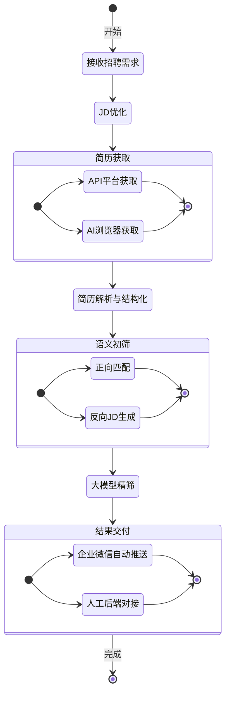
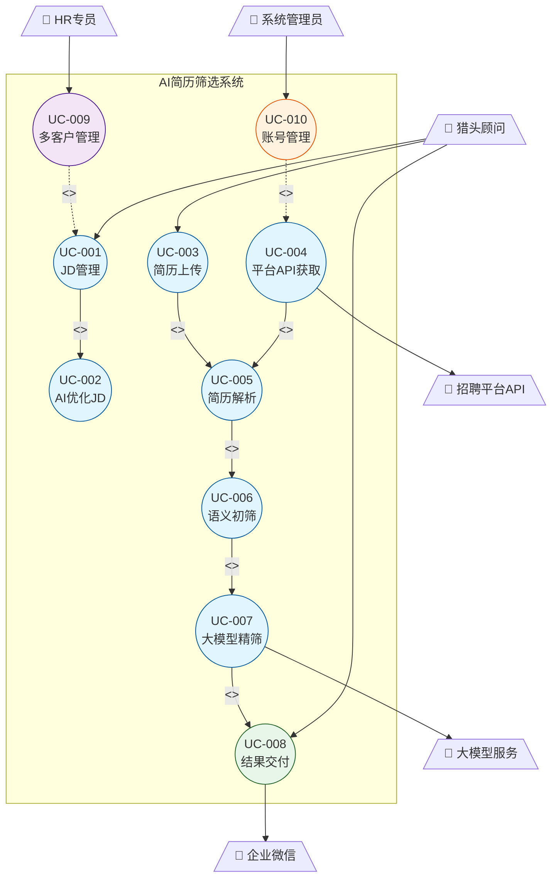
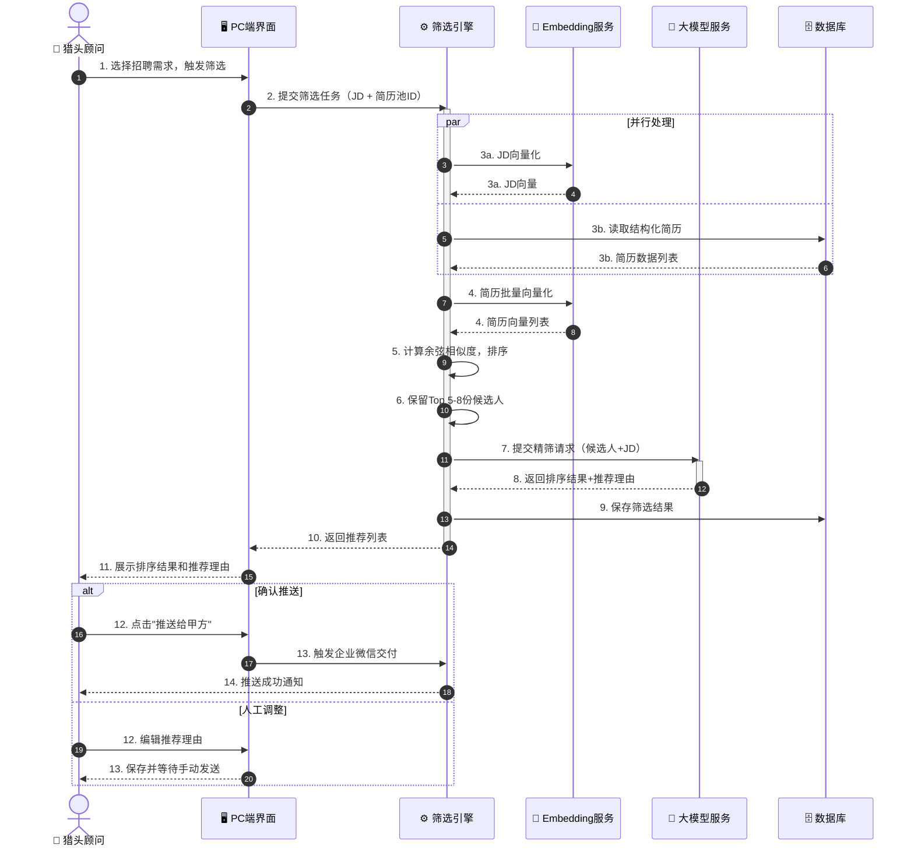
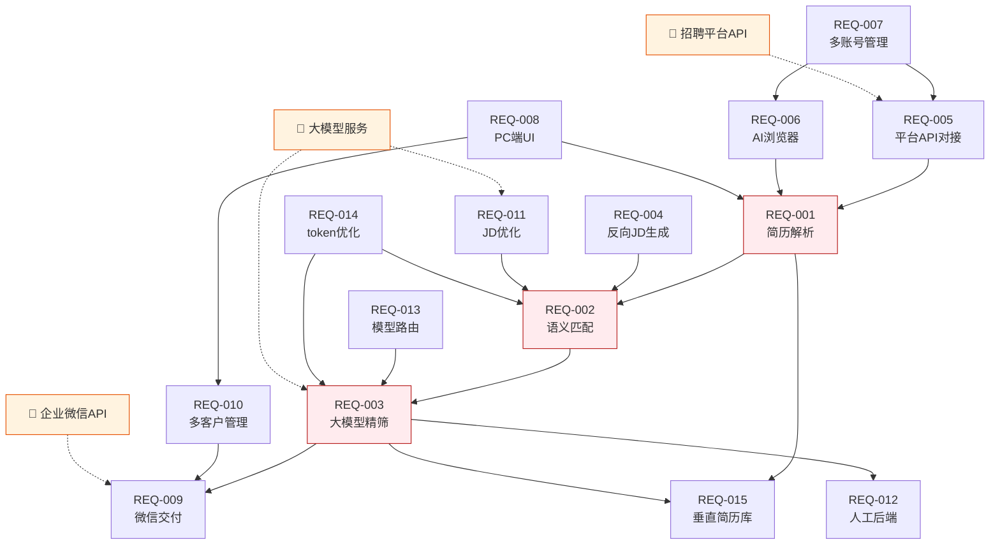

# 需求分析：AI驱动的简历筛选系统

**创建日期**：2026-04-04
**状态**：已完成

---

## 1. 用户角色

| 角色 | 描述 | 核心目标 |
|------|------|----------|
| 猎头顾问 | 核心操作用户，负责筛选简历并向甲方推荐候选人 | 快速从大量简历中精准筛出3份推荐 |
| HR专员（RPO） | 管理多个甲方客户的招聘需求，监控交付质量 | 多客户并行管理，自动化交付 |
| 甲方企业HR | 接收推荐结果的最终客户 | 收到精准推荐，减少面试轮次 |
| 系统管理员 | 管理账号、平台配置和模型路由 | 保障系统稳定运行 |

---

## 2. 核心用户活动流



### 活动详情

| 活动 | 描述 | 输入 | 输出 | 参与者 |
|------|------|------|------|--------|
| 接收招聘需求 | 获取甲方JD，对齐用人需求 | 原始JD文本 | 标准化JD | 猎头顾问、HR专员 |
| JD优化 | AI辅助规范化JD，补全缺失字段 | 原始JD | 优化后JD | 系统、猎头顾问 |
| 简历获取 | 从多平台获取候选人简历 | 平台账号、JD关键词 | 原始简历文件 | 系统（API/AI浏览器） |
| 简历解析与结构化 | 将多格式简历切片为标准结构 | Word/PDF简历 | 结构化简历数据 | 系统 |
| 语义初筛 | embedding向量化匹配，保留5-8份 | 结构化简历、JD | 初筛候选人列表+匹配分 | 系统（AI） |
| 大模型精筛 | 大模型二次评判，输出排序和推荐理由 | 初筛候选人 | 排序结果+推荐理由 | 系统（大模型） |
| 结果交付 | 自动推送或人工对接，交付给甲方 | 推荐结果 | 甲方收到推荐 | 系统、猎头顾问 |


---

## 3. 用户故事地图

| 活动 | MVP v1.0 | v1.1 | v2.0 |
|------|----------|------|------|
| JD管理 | US-001, US-002 | US-003 | - |
| 简历获取 | US-004 | US-005, US-006 | US-007 |
| 简历筛选 | US-008, US-009, US-010 | US-011 | - |
| 结果交付 | US-012 | - | US-013 |
| 多客户管理 | US-014, US-015 | US-016 | - |
| 系统配置 | US-019 | - | US-017, US-018 |

---

## 4. 用户故事

### 活动一：JD管理

#### US-001：上传并管理招聘需求

**优先级**：P0 | **角色**：猎头顾问 | **版本**：MVP

> 作为猎头顾问，
> 我希望能在系统中创建和管理多个招聘需求（JD），
> 以便同时跟进多个客户的招聘项目。

**验收标准**：
```gherkin
Scenario: 创建新招聘需求
  Given 猎头顾问已登录系统
  When 填写职位名称、客户名称并上传或粘贴JD内容
  Then 系统保存该需求并显示在需求列表中
  And 需求状态显示为"进行中"
```

---

#### US-002：AI辅助优化JD

**优先级**：P0 | **角色**：猎头顾问 | **版本**：MVP

> 作为猎头顾问，
> 我希望系统能自动识别JD中的不规范内容并给出优化建议，
> 以便减少与甲方反复沟通对齐的时间。

**验收标准**：
```gherkin
Scenario: JD优化建议
  Given 猎头顾问上传了一份不规范的JD
  When 点击"AI优化"按钮
  Then 系统在30秒内返回优化后的JD草稿
  And 高亮显示修改内容，供用户确认或编辑
```

---

#### US-003：从简历反向生成JD

**优先级**：P1 | **角色**：猎头顾问 | **版本**：v1.1

> 作为猎头顾问，
> 我希望系统能根据优质候选人简历反向生成对应JD，
> 以便提升JD与候选人的双向匹配精度。

**验收标准**：
```gherkin
Scenario: 反向生成JD
  Given 系统已有结构化简历数据
  When 选择一份或多份参考简历并触发反向生成
  Then 系统生成一份对应JD草稿
  And 可与原JD对比查看差异
```

---

### 活动二：简历获取

#### US-004：手动上传简历

**优先级**：P0 | **角色**：猎头顾问 | **版本**：MVP

> 作为猎头顾问，
> 我希望能批量上传Word/PDF格式的简历文件，
> 以便在没有平台API的情况下也能使用筛选功能。

**验收标准**：
```gherkin
Scenario: 批量上传简历
  Given 猎头顾问选择了一个招聘需求
  When 上传1-200份Word或PDF格式简历
  Then 系统解析所有文件并显示解析进度
  And 解析完成后显示结构化简历列表
  And 不支持的格式显示错误提示
```

---

#### US-005：对接招聘平台API获取简历

**优先级**：P1 | **角色**：系统管理员 | **版本**：v1.1

> 作为系统管理员，
> 我希望配置BOSS直聘、猎聘、拉钩等平台的API接入，
> 以便系统自动拉取候选人简历，减少手动操作。

**验收标准**：
```gherkin
Scenario: API平台简历同步
  Given 已配置某招聘平台的API密钥
  When 猎头顾问在该需求下触发"同步简历"
  Then 系统调用平台API拉取匹配简历
  And 自动解析并加入候选人池
  And 显示同步数量和耗时
```

---

#### US-006：多账号管理

**优先级**：P1 | **角色**：系统管理员 | **版本**：v1.1

> 作为系统管理员，
> 我希望按客户和平台分类管理多个招聘平台账号（支持多平台），
> 以便支持猎头/RPO机构同时服务多个甲方客户。

**验收标准**：
```gherkin
Scenario: 添加平台账号
  Given 管理员进入账号管理页面
  When 填写平台类型、账号、密码并关联客户
  Then 系统保存账号信息（密码加密存储）
  And 可配置自动轮换登录策略
```

---

#### US-007：AI浏览器获取无API平台简历

**优先级**：P2 | **角色**：系统 | **版本**：v2.0

> 作为猎头顾问，
> 我希望系统能自动从无API的招聘平台获取简历，
> 以便覆盖更广泛的候选人来源。

**验收标准**：
```gherkin
Scenario: AI浏览器简历获取
  Given 已配置目标平台账号
  When 触发AI浏览器任务
  Then 系统在沙箱环境中模拟浏览操作
  And 自动判断是否需要付费下载
  And 获取到的简历自动加入候选人池
  And 遇到反爬拦截时记录日志并通知用户
```

---

### 活动三：简历筛选

#### US-008：简历结构化解析

**优先级**：P0 | **角色**：系统 | **版本**：MVP

> 作为猎头顾问，
> 我希望系统自动将不同格式的简历解析为标准结构，
> 以便后续进行统一的匹配和比较。

**验收标准**：
```gherkin
Scenario: 简历结构化解析成功
  Given 上传了Word或PDF格式的简历
  When 系统完成解析
  Then 简历被切片为：基本信息、工作经历、项目经历、教育背景、技能
  And 每个字段有明确的结构化数据

Scenario: 解析失败自动重试
  Given 上传了扫描版PDF等难以解析的简历
  When 首次解析失败
  Then 系统自动调用OCR服务重试，最多重试3次
  And 重试成功则正常进入筛选池

Scenario: 多次重试仍失败
  Given 简历经过3次OCR重试仍无法解析
  Then 系统将该简历标记为"需人工处理"
  And 在界面上单独列出，提示用户手动补录关键信息
  And 用户补录完成后可手动将其重新加入筛选池
```
> [已澄清 Q4] 先自动OCR重试（最多3次），全部失败后标记为"需人工处理"。

---

#### US-009：语义匹配初筛

**优先级**：P0 | **角色**：系统 | **版本**：MVP

> 作为猎头顾问，
> 我希望系统通过语义匹配自动对简历评分并初步筛选，
> 以便从大量简历中快速缩小候选范围。

**验收标准**：
```gherkin
Scenario: 手动触发筛选
  Given 已有结构化简历和优化后的JD
  When 猎头顾问点击"开始筛选"按钮
  Then 系统使用embedding向量化计算匹配分数
  And 按分数排序，保留前N份候选人（N由该需求的shortlist_limit配置，默认6）
  And 每份简历显示匹配分数和匹配维度说明
  And 200份简历的初筛耗时不超过5分钟

Scenario: 定时自动触发筛选
  Given 招聘需求已配置定时筛选规则（频率+时间窗口）
  And 简历池中有新增简历
  When 到达配置的触发时间
  Then 系统自动创建筛选任务并执行
  And 完成后同时发送系统内站内消息和企业微信通知给猎头顾问
  And 两个渠道均记录通知状态（已发送/已读）
  And 任务记录中标注触发方式为"定时自动"
```
> [已澄清 Q1] 同时支持手动触发和定时自动触发两种模式。

---

#### US-010：大模型精筛与推荐理由

**优先级**：P0 | **角色**：系统 | **版本**：MVP

> 作为猎头顾问，
> 我希望系统对初筛结果进行大模型二次评判并生成推荐理由，
> 以便直接将结果交付给甲方，无需再次人工撰写。

**验收标准**：
```gherkin
Scenario: 大模型精筛
  Given 初筛保留了5-8份候选人
  When 系统调用大模型进行二次评判
  Then 输出候选人排序（第1-3名）
  And 每位候选人附带结构化推荐理由（优势、匹配点、潜在风险）
  And token消耗不超过全流程大模型方案的1/50
```

---

#### US-011：模型路由策略

**优先级**：P2 | **角色**：系统管理员 | **版本**：v2.0

> 作为系统管理员，
> 我希望配置中文场景使用国内大模型、出海场景使用海外模型，
> 以便在不同业务场景下优化成本和效果。

**验收标准**：
```gherkin
Scenario: 模型路由配置
  Given 管理员进入模型配置页面
  When 设置语言/地区路由规则
  Then 系统根据JD语言自动选择对应模型
  And 可手动覆盖自动路由
  And 记录每次调用使用的模型和token消耗
```

---

### 活动四：结果交付

#### US-012：企业微信自动交付

**优先级**：P0 | **角色**：系统 | **版本**：MVP

> 作为猎头顾问，
> 我希望筛选结果自动推送到企业微信，
> 以便甲方及时收到推荐，减少人工发送步骤。

**验收标准**：
```gherkin
Scenario: 企业微信自动推送
  Given 大模型精筛已完成
  When 猎头顾问确认推送
  Then 系统通过企业微信API发送结构化消息卡片
  And 卡片包含：候选人姓名、匹配分数、推荐理由摘要
  And 同时附带候选人简历PDF附件
  And 发送成功后记录交付时间和接收方
  And 若PDF发送失败，卡片中提供简历下载链接作为降级方案
```
> [已澄清 Q3] 同时发送结构化消息卡片和简历PDF附件。

---

#### US-013：人工后端对接

**优先级**：P2 | **角色**：猎头顾问 | **版本**：v2.0

> 作为猎头顾问，
> 我希望在自动交付之外保留人工介入和定制化服务的能力，
> 以便在需要时提供更有温度的服务体验。

**验收标准**：
```gherkin
Scenario: 人工后端介入
  Given 自动筛选结果已生成
  When 猎头顾问选择"人工审核"模式
  Then 可编辑推荐理由、调整排序
  And 可添加个性化备注
  And 最终由人工确认后再发送给甲方
```

---

### 活动五：多客户管理

#### US-014：多客户多需求管理（基础）

**优先级**：P0 | **角色**：HR专员 | **版本**：MVP

> 作为HR专员，
> 我希望在系统中管理多个客户的多个招聘需求，
> 以便清晰跟踪每个项目的进度和状态。

**验收标准**：
```gherkin
Scenario: 查看多客户需求列表
  Given HR专员已登录
  When 进入需求管理页面
  Then 显示所有客户的招聘需求列表
  And 可按客户、状态、创建时间筛选
  And 每个需求显示：客户名、职位、候选人数、当前阶段
```

---

#### US-015：用户-公司权限管理

**优先级**：P0 | **角色**：猎头顾问/HR专员 | **版本**：MVP

> 作为猎头顾问或HR专员，
> 我希望能管理多个公司并在不同公司间切换，
> 以便同时服务多个客户公司。

**验收标准**：
```gherkin
Scenario: 用户管理多个公司
  Given 用户已登录系统
  When 进入公司管理页面
  Then 显示用户有权限的所有公司列表
  And 可以切换当前工作公司
  And 切换后所有数据（JD、简历、筛选任务）按当前公司隔离显示

Scenario: 公司数据隔离
  Given 用户切换到公司A
  When 查看招聘需求列表
  Then 只显示公司A的招聘需求
  And 无法访问其他公司的数据
```

---

#### US-016：BOSS直聘账号绑定

**优先级**：P0 | **角色**：系统管理员 | **版本**：MVP

> 作为系统管理员，
> 我希望为每个公司配置BOSS直聘账号，
> 以便系统能自动从BOSS直聘获取简历。

**验收标准**：
```gherkin
Scenario: 绑定BOSS直聘账号
  Given 管理员进入公司配置页面
  When 选择某个公司并填写BOSS直聘账号和密码
  Then 系统保存账号信息（密码使用AES-256加密）
  And 显示绑定成功提示
  And 可以测试账号连接状态

Scenario: 账号安全存储
  Given 已绑定BOSS直聘账号
  When 查看账号配置
  Then 密码字段显示为加密状态（***）
  And 只有授权管理员可以修改
```

---

### 活动六：系统配置

#### US-017：token消耗监控与优化

**优先级**：P2 | **角色**：系统管理员 | **版本**：v2.0

> 作为系统管理员，
> 我希望实时监控每次筛选任务的token消耗，
> 以便验证成本控制目标并优化调用策略。

**验收标准**：
```gherkin
Scenario: 查看token消耗报告
  Given 管理员进入成本监控页面
  When 查看某次筛选任务详情
  Then 显示各阶段token消耗明细
  And 与全流程大模型方案的基准值对比
  And 超出阈值时发出告警
```

---

#### US-018：垂直简历库管理

**优先级**：P2 | **角色**：系统管理员 | **版本**：v2.0

> 作为系统管理员，
> 我希望系统自动沉淀历史筛选数据形成垂直简历库，
> 以便为第二阶段平台化提供数据基础。

**验收标准**：
```gherkin
Scenario: 简历库数据沉淀
  Given 筛选任务完成且候选人已授权
  When 系统自动归档结构化简历数据
  Then 简历数据按行业、职能、地区分类存储
  And 支持基于简历库的快速检索
  And 数据脱敏处理后可用于模型训练
```


#### US-019：公司管理界面

**优先级**：P0 | **角色**：系统管理员 | **版本**：MVP

> 作为系统管理员，
> 我希望有一个公司管理界面来配置公司信息和BOSS直聘账号，
> 以便集中管理所有公司的配置。

**验收标准**：
```gherkin
Scenario: 公司管理界面
  Given 管理员已登录
  When 进入公司管理页面
  Then 显示所有公司列表
  And 可以添加、编辑、删除公司
  And 可以为每个公司配置BOSS直聘账号
  And 可以查看每个公司的用户权限分配
```

---

## 5. 用例图



---

## 6. 核心用例详情

### UC-007：大模型精筛主流程



---

## 7. 成功标准

| SC ID | 需求 | 类别 | 度量指标 | 目标值 | 验证方式 |
|-------|------|------|----------|--------|----------|
| SC-001 | US-009 | 性能 | 200份简历初筛耗时 | < 5分钟 | 自动化测试 |
| SC-002 | US-010 | 成本 | token消耗 vs 全流程大模型方案 | ≤ 1/50 | 监控统计 |
| SC-003 | US-010 | 质量 | 猎头对推荐结果满意度 | ≥ 70% | 用户反馈 |
| SC-004 | US-008 | 功能 | 简历解析字段完整率 | ≥ 95% | 测试用例 |
| SC-005 | US-012 | 功能 | 企业微信推送成功率 | ≥ 99% | 监控告警 |
| SC-006 | US-002 | 性能 | JD优化响应时间 | < 30秒 | 接口测试 |
| SC-007 | US-014 | 可用性 | 系统可用性SLA | ≥ 99.5% | 监控统计 |
| SC-008 | US-017 | 成本 | token消耗超阈值告警响应 | < 5分钟 | 告警测试 |

---

## 8. 依赖关系分析



### 关键路径

| 步骤 | 需求ID | 描述 | 依赖 | 风险 |
|------|--------|------|------|------|
| 1 | REQ-001 | 简历解析与结构化 | 无 | 入口，阻塞所有后续 |
| 2 | REQ-002 | 语义匹配初筛 | REQ-001 | 依赖embedding服务 |
| 3 | REQ-003 | 大模型精筛 | REQ-002 | 依赖外部大模型API |
| 4 | REQ-009 | 企业微信交付 | REQ-003 | 依赖企业微信API |

**关键路径**：REQ-001 → REQ-002 → REQ-003 → REQ-009
**瓶颈**：REQ-003（外部大模型依赖，需备用方案）

---

## 9. 可行性评估

| 需求 | 技术可行性 | 风险等级 | 说明 |
|------|------------|----------|------|
| REQ-001 简历解析 | 高 | 低 | 成熟方案，Apache Tika/PyMuPDF等 |
| REQ-002 语义匹配 | 高 | 低 | embedding技术成熟，已有验证 |
| REQ-003 大模型精筛 | 高 | 中 | 依赖外部API，需考虑限流和备用 |
| REQ-004 反向JD生成 | 高 | 低 | 大模型能力范围内 |
| REQ-005 平台API对接 | 中 | 中 | 各平台API政策不同，需逐一对接 |
| REQ-006 AI浏览器 | 低 | 高 | 反爬对抗风险高，效果不确定 |
| REQ-007 多账号管理 | 高 | 低 | 标准功能实现 |
| REQ-008 PC端UI | 高 | 低 | 当前阶段重点，已有明确方向 |
| REQ-009 微信交付 | 高 | 低 | 企业微信API文档完善 |
| REQ-010 多客户管理 | 高 | 低 | 标准多租户设计 |
| REQ-011 JD优化 | 高 | 低 | 大模型能力范围内 |
| REQ-012 人工后端 | 高 | 低 | 标准功能实现 |
| REQ-013 模型路由 | 高 | 低 | 配置化路由策略 |
| REQ-014 token优化 | 中 | 中 | 需架构设计配合，三层漏斗已验证 |
| REQ-015 垂直简历库 | 中 | 中 | 数据合规和隐私保护需重点关注 |

---

## 10. 非功能性需求（NFR）

### 性能

| NFR ID | 需求 | 指标 | 目标 | 关联需求 |
|--------|------|------|------|----------|
| NFR-P01 | 简历初筛响应 | 200份简历处理时间 | < 5分钟 | REQ-002 |
| NFR-P02 | JD优化响应 | 接口响应时间 | < 30秒 | REQ-011 |
| NFR-P03 | 页面加载 | 首屏加载时间 | < 2秒 | REQ-008 |
| NFR-P04 | token消耗 | vs 全流程大模型方案 | ≤ 1/50 | REQ-014 |

### 安全

| NFR ID | 需求 | 指标 | 目标 | 关联需求 |
|--------|------|------|------|----------|
| NFR-S01 | 账号密码存储 | 加密方式 | AES-256加密 | REQ-007 |
| NFR-S02 | 数据传输 | 传输加密 | TLS 1.3 | 全部 |
| NFR-S03 | 简历数据隐私 | 数据脱敏 | 简历数据默认保留1年，到期前30天提醒，到期后自动脱敏归档（删除原始文件和PII字段），用户可申请延期 | REQ-015 |
| NFR-S04 | 访问控制 | 权限隔离 | 数据库行级安全策略（RLS），严格防止跨客户数据访问，所有查询必须通过RLS校验 | REQ-010 |

### 可靠性

| NFR ID | 需求 | 指标 | 目标 | 关联需求 |
|--------|------|------|------|----------|
| NFR-R01 | 系统可用性 | SLA | ≥ 99.5% | 全部 |
| NFR-R02 | 大模型服务降级 | 备用方案 | 主模型不可用时自动切换备用模型，用户无感知，任务记录标注实际使用模型 | REQ-003, REQ-013 |
| NFR-R03 | 数据备份 | 备份频率 | 每日全量备份 | REQ-015 |

### 兼容性

| NFR ID | 需求 | 指标 | 目标 | 关联需求 |
|--------|------|------|------|----------|
| NFR-C01 | 浏览器支持 | 主流浏览器 | Chrome/Edge/Safari最新两个版本 | REQ-008 |
| NFR-C02 | 简历格式 | 支持格式 | Word（.doc/.docx）、PDF | REQ-001 |
| NFR-C03 | 企业微信版本 | 兼容版本 | 企业微信3.x及以上 | REQ-009 |

---

## 11. 分析摘要

**识别的用户角色**：猎头顾问、HR专员（RPO）、甲方企业HR、系统管理员

**核心活动链**：JD管理 → 简历获取 → 解析结构化 → 语义初筛 → 大模型精筛 → 结果交付

**关键发现**：
- REQ-006（AI浏览器）是最高风险需求，建议单独立项技术预研
- REQ-003 依赖外部大模型API，需设计降级和备用方案
- REQ-015 垂直简历库涉及数据合规，需提前咨询法务

**主要风险**：
- 外部大模型API限流/不可用：需多模型备用策略
- 招聘平台反爬对抗：AI浏览器方案效果不确定
- 候选人数据隐私合规：简历数据存储需符合个人信息保护法

---

## 12. 相关产物

> 数据模型详见 `data-model.md`

| 实体 | 描述 | 状态 |
|------|------|------|
| Job（招聘需求） | JD及需求管理 | 已定义 |
| Resume（简历） | 原始及结构化简历 | 已定义 |
| Candidate（候选人） | 筛选结果中的候选人 | 已定义 |
| Client（客户） | 甲方客户信息 | 已定义 |
| ScreeningTask（筛选任务） | 每次筛选任务记录 | 已定义 |
| PlatformAccount（平台账号） | 招聘平台账号管理 | 已定义 |

---

## 下一步

- [ ] 进入第四阶段：需求澄清（消除歧义，确认边界条件）
