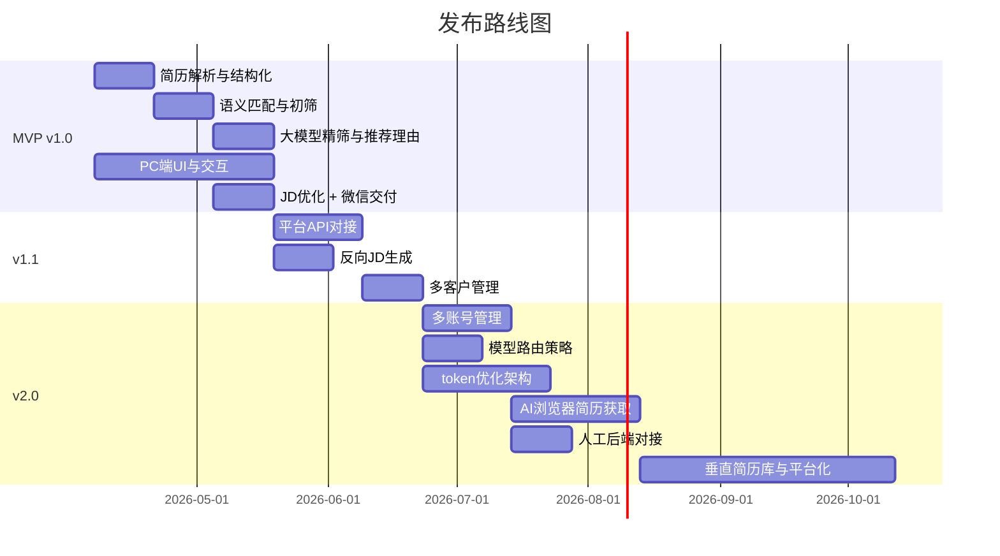

# 价值排序：AI驱动的简历筛选系统

**创建日期**：2026-04-04
**状态**：已完成

---

## 1. MoSCoW 分类

### 汇总

| 类别 | 数量 | 占比 | 状态 |
|------|------|------|------|
| MUST（必须有） | 15 | 100% | ⚠️ 已由用户确认突破30%限制 |
| SHOULD（应该有） | 0 | 0% | - |
| COULD（可以有） | 0 | 0% | - |
| WON'T（本期不做） | 0 | 0% | - |

### MUST Have（全部，已由用户确认）

| 需求ID | 需求描述 | 说明 |
|--------|----------|------|
| REQ-001 | 多格式简历解析与结构化（Word/PDF） | 整个流程的入口，基础依赖 |
| REQ-002 | JD与简历语义匹配评分（embedding向量化初筛） | 核心价值主张 |
| REQ-003 | 大模型二次精筛，输出排序和推荐理由 | 最终交付物核心 |
| REQ-004 | 从简历反向生成JD（正反翻译匹配） | 提升匹配精度 |
| REQ-005 | 对接有API的头部招聘平台 | 数据来源核心渠道 |
| REQ-006 | AI浏览器自动获取无API平台简历 | 扩展数据来源覆盖 |
| REQ-007 | 多账号管理（按客户/平台分类，自动轮换登录） | 多客户场景必需 |
| REQ-008 | PC端前端入口（基础UI与交互） | 当前阶段重点 |
| REQ-009 | 企业微信自动交付筛选结果 | 交付闭环必需 |
| REQ-010 | 多客户多招聘需求管理 | RPO核心场景 |
| REQ-011 | AI辅助优化不规范JD | 减少沟通成本 |
| REQ-012 | 保留人工后端对接能力 | 保留服务温度 |
| REQ-013 | 模型路由策略（中文/出海） | 成本与效果优化 |
| REQ-014 | token消耗优化（目标：全流程大模型方案的1/50） | 商业化成本控制 |
| REQ-015 | 第二阶段垂直简历库沉淀与平台化 | 商业化核心目标 |

**MUST 数量**：15 / 15 = 100% ⚠️（已由用户确认）

### SHOULD Have

无。

### COULD Have

无。

### WON'T Have（本期不做）

无。


---

## 2. RICE 评分

> Reach：每季度受影响用户数（估算）；Impact：0.25/0.5/1/2/3；Confidence：数据支撑程度；Effort：人月

| 需求ID | Reach | Impact | Confidence | Effort | RICE分 | 排名 |
|--------|-------|--------|------------|--------|--------|------|
| REQ-002 | 500 | 3 | 90% | 2 | 675 | 1 |
| REQ-003 | 500 | 3 | 85% | 2 | 638 | 2 |
| REQ-001 | 500 | 2 | 95% | 1 | 950 | — |
| REQ-011 | 500 | 2 | 80% | 1 | 800 | 3 |
| REQ-009 | 400 | 2 | 85% | 1 | 680 | 4 |
| REQ-004 | 500 | 2 | 75% | 2 | 375 | 5 |
| REQ-005 | 400 | 2 | 80% | 2 | 320 | 6 |
| REQ-010 | 300 | 2 | 80% | 2 | 240 | 7 |
| REQ-008 | 500 | 1 | 95% | 3 | 158 | 8 |
| REQ-007 | 200 | 1 | 70% | 2 | 70 | 9 |
| REQ-012 | 300 | 0.5 | 70% | 1 | 105 | 10 |
| REQ-013 | 200 | 0.5 | 60% | 1 | 60 | 11 |
| REQ-006 | 300 | 2 | 40% | 4 | 60 | 12 |

> REQ-001 虽RICE分高，但属于基础依赖项，不参与排名竞争，直接纳入MVP。

**公式**：RICE分 = (Reach × Impact × Confidence) / Effort

---

## 3. 价值-成本矩阵

```mermaid
quadrantChart
    title 价值-成本分析
    x-axis 低成本 --> 高成本
    y-axis 低价值 --> 高价值
    quadrant-1 P0: 快速赢
    quadrant-2 P1: 战略投入
    quadrant-3 P2: 填充项
    quadrant-4 P3: 规避
    简历解析REQ001: [0.15, 0.95]
    语义匹配REQ002: [0.45, 0.95]
    大模型精筛REQ003: [0.45, 0.90]
    JD优化REQ011: [0.2, 0.75]
    微信交付REQ009: [0.2, 0.70]
    反向生成JDREQ004: [0.5, 0.75]
    平台APIREQ005: [0.55, 0.70]
    多客户管理REQ010: [0.5, 0.65]
    PC端UIREQ008: [0.6, 0.85]
    多账号管理REQ007: [0.45, 0.40]
    人工后端REQ012: [0.25, 0.35]
    模型路由REQ013: [0.3, 0.30]
    AI浏览器REQ006: [0.85, 0.65]
```

| 优先级 | 需求 | 行动 |
|--------|------|------|
| P0（快速赢） | REQ-001、REQ-011、REQ-009 | 优先做，低成本高价值 |
| P1（战略投入） | REQ-002、REQ-003、REQ-008、REQ-004、REQ-005、REQ-010 | 值得投入，需规划 |
| P2（填充项） | REQ-007、REQ-012、REQ-013、REQ-014 | 随版本迭代交付 |
| P3（高风险，仍需交付） | REQ-006 | 技术风险高，需专项攻关 |


---

## 4. 发布计划

### MVP（v1.0）— 核心筛选闭环

**主题**：跑通从JD输入到推荐结果输出的完整流程

| 需求ID | 需求描述 | 优先级 |
|--------|----------|--------|
| REQ-001 | 多格式简历解析与结构化 | MUST |
| REQ-002 | JD与简历语义匹配评分（embedding初筛） | MUST |
| REQ-003 | 大模型二次精筛，输出排序和推荐理由 | MUST |
| REQ-008 | PC端基础UI与交互 | MUST |
| REQ-011 | AI辅助优化不规范JD | MUST |
| REQ-009 | 企业微信自动交付结果 | MUST |

**MVP成功指标**：
- 从200份简历中筛出5-8份候选人，耗时 < 10分钟
- 猎头顾问对推荐结果满意度 ≥ 70%
- token消耗 ≤ 全流程大模型方案的 1/50

---

### v1.1 — 数据来源扩展

**主题**：打通招聘平台数据，减少手动上传

| 需求ID | 需求描述 | 优先级 |
|--------|----------|--------|
| REQ-004 | 从简历反向生成JD（正反翻译匹配） | MUST |
| REQ-005 | 对接有API的头部招聘平台 | MUST |
| REQ-010 | 多客户多招聘需求管理 | MUST |

---

### v2.0 — 规模化与平台化

**主题**：支撑RPO多客户规模化运营，探索商业化

| 需求ID | 需求描述 | 优先级 |
|--------|----------|--------|
| REQ-007 | 多账号管理（自动轮换登录） | MUST |
| REQ-012 | 人工后端对接能力 | MUST |
| REQ-013 | 模型路由策略（中文/出海） | MUST |
| REQ-014 | token消耗优化（架构级，贯穿全程） | MUST |
| REQ-006 | AI浏览器获取无API平台简历 | MUST |
| REQ-015 | 垂直简历库沉淀与平台化 | MUST |

---

### 发布路线图



---

## 下一步

- [ ] 进入第三阶段：需求分析（拆解用户故事、用例与数据模型）
