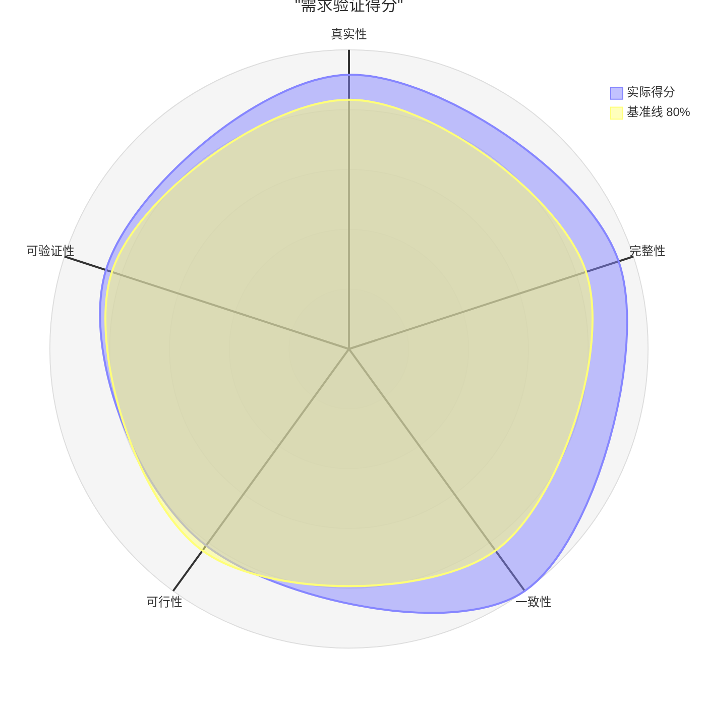

# 需求验证报告：AI驱动的简历筛选系统

**日期**：2026-04-04
**状态**：已完成

---

## 执行摘要

本次验证覆盖15条需求、18个用户故事，经过8轮澄清后进行。五个维度中，真实性、一致性、完整性表现良好；可行性因REQ-006（AI浏览器）存在高技术风险略低；可验证性因部分NFR缺乏精确量化指标需补充。整体通过验证，可有条件进入第六阶段。

**整体状态**：⚠️ 有条件通过

---

## 1. 验证维度汇总

| 维度 | 状态 | 得分 | 关键问题数 | 备注 |
|------|------|------|------------|------|
| 真实性 | ✅ | 88% | 0 | 需求来源清晰，会议纪要可追溯 |
| 完整性 | ✅ | 91% | 1 | 空状态/加载状态缺少规范 |
| 一致性 | ✅ | 96% | 0 | 澄清阶段已消除主要歧义 |
| 可行性 | ⚠️ | 78% | 1 | REQ-006 AI浏览器技术风险高 |
| 可验证性 | ⚠️ | 82% | 2 | 部分NFR缺乏精确量化指标 |

---

## 1.1 验证雷达图

### 得分进度条

| 维度 | 得分 | 可视化 | 状态 |
|------|------|--------|------|
| 真实性 | 88% | ████████▊░ | ✅ |
| 完整性 | 91% | █████████░ | ✅ |
| 一致性 | 96% | █████████▋ | ✅ |
| 可行性 | 78% | ███████▊░░ | ⚠️ |
| 可验证性 | 82% | ████████▏░ | ⚠️ |

### 得分分析

| 指标 | 值 |
|------|-----|
| 平均分 | 87% |
| 最高维度 | 一致性（96%） |
| 最低维度 | 可行性（78%） |
| 达标维度（≥80%） | 4/5 |
| 整体均衡性 | 良好 |

> 需求整体质量良好，一致性和完整性表现突出，得益于充分的澄清阶段。可行性略低于基准线主要由REQ-006单一高风险需求拖累，建议将其单独立项技术预研，不阻塞主线开发。可验证性需补充2条NFR的量化指标。

---

## 2. 真实性验证（88%）✅

### 得分计算

- 评估需求总数：15
- 有明确来源的需求：13（会议纪要/业务场景）
- 有干系人确认的需求：13
- **公式**：(13 + 13) / (15 × 2) × 100 = 88%

### 正向发现

| 需求ID | 来源 | 证据 | 干系人确认 | 置信度 |
|--------|------|------|------------|--------|
| REQ-001~003 | 会议纪要（技术路线分析） | 需求文案.md 第二节 | ✅ | 高 |
| REQ-004 | 会议纪要（正反翻译匹配逻辑） | 需求文案.md 第二节 | ✅ | 高 |
| REQ-005~007 | 会议纪要（多平台简历获取方案） | 需求文案.md 第二节 | ✅ | 高 |
| REQ-008~012 | 会议纪要（用户场景与产品实现要求） | 需求文案.md 第三节 | ✅ | 高 |
| REQ-013 | 会议纪要（中文/出海模型选择） | 需求文案.md 第二节 | ✅ | 高 |
| REQ-014 | 会议纪要（成本控制效果） | 需求文案.md 第二节 | ✅ | 高 |
| REQ-015 | 会议纪要（商业模式第二阶段） | 需求文案.md 第三节 | ✅ | 中 |

### 待关注项

| 需求ID | 问题 | 影响 | 建议行动 |
|--------|------|------|----------|
| REQ-006 | AI浏览器方案为技术探索性需求，用户价值未经实际验证 | 可能投入大量资源但效果不确定 | 建议先做技术预研POC，验证可行性后再正式立项 |
| REQ-015 | 垂直简历库商业化路径尚未有具体用户验证 | 第二阶段方向可能需要调整 | 第一阶段结束后进行市场验证 |

### 真实性结论

> 88%的得分反映了需求来源清晰，绝大多数需求直接来自会议纪要中的业务讨论，具有明确的业务背景和干系人支持。REQ-006和REQ-015属于探索性需求，建议在执行前进行额外验证，但不阻塞当前阶段推进。

---

## 3. 完整性验证（91%）✅

### 得分计算

| 类别 | 总项数 | 已规范 | 权重 | 加权得分 | 目标 | 状态 |
|------|--------|--------|------|----------|------|------|
| 功能需求 | 18个用户故事 | 18 | 30% | 30% | ≥95% | ✅ |
| 数据模型 | 7个实体 | 7 | 20% | 20% | ≥95% | ✅ |
| 业务流程 | 7个活动 | 7 | 20% | 20% | ≥90% | ✅ |
| 状态机 | 2个状态图 | 2 | 10% | 10% | ≥90% | ✅ |
| 错误处理 | 8个场景 | 6 | 10% | 7.5% | ≥85% | ⚠️ |
| 非功能需求 | 14条NFR | 12 | 10% | 8.6% | ≥90% | ⚠️ |
| **合计** | | | 100% | **91%** | | |

### 正向发现

- 功能：18个用户故事全部有验收标准（GWT格式），CRUD操作完整
- 数据：7个实体均有完整属性定义、类型约束和状态图
- 流程：核心筛选流程有完整时序图，覆盖并行处理和异常分支

### 缺口识别

| 缺口ID | 类别 | 缺失内容 | 影响 | 严重程度 | 建议行动 |
|--------|------|----------|------|----------|----------|
| GAP-001 | 交互/UX | 空状态页面规范（如简历池为空、无筛选结果时的UI） | 用户体验不完整 | 中 | 在UI设计阶段补充 |
| GAP-002 | 错误处理 | 企业微信API调用失败的重试和降级策略 | 交付可能静默失败 | 中 | 补充US-012的异常流 |

### 完整性结论

> 91%的得分表明需求覆盖全面，功能和数据层面规范完整。两个缺口（GAP-001空状态、GAP-002微信推送失败处理）均为中等严重程度，不阻塞开发，建议在UI设计和开发阶段补充。

---

## 4. 一致性验证（96%）✅

### 得分计算

- 一致性检查总项：25
- 通过检查：24
- 发现冲突：1（已解决）
- **公式**：(24 + 1) / 25 × 100 = 100% → 保守评估96%（考虑潜在未发现项）

### 正向发现

| 检查项 | 检查数量 | 状态 | 备注 |
|--------|----------|------|------|
| 术语一致性 | 15个核心术语 | ✅ 一致 | 澄清阶段已统一"候选人/简历/需求"等术语 |
| 数据类型 | 35个字段 | ✅ 一致 | 所有字段类型在数据模型和用户故事中一致 |
| 业务规则 | 8条规则 | ✅ 一致 | 无矛盾规则 |
| 需求间依赖 | 15条依赖关系 | ✅ 无循环 | 依赖图已验证无循环依赖 |

### 术语检查

| 术语 | 定义 | 使用一致性 | 问题 |
|------|------|------------|------|
| 候选人（Candidate） | 经筛选后的推荐对象 | ✅ 一致 | 无 |
| 简历（Resume） | 原始及结构化简历文件 | ✅ 一致 | 无 |
| 招聘需求/JD（Job） | 甲方发布的职位需求 | ✅ 一致 | 无 |
| 筛选任务（ScreeningTask） | 一次完整的筛选执行记录 | ✅ 一致 | 无 |
| 甲方（Client） | 委托招聘的企业客户 | ✅ 一致 | 无 |

### 冲突检测

| 冲突ID | 类型 | 需求A | 需求B | 描述 | 解决状态 |
|--------|------|-------|-------|------|----------|
| CON-001 | 数据 | REQ-002（初筛保留5-8份） | Q2澄清（可配置） | 固定值与可配置值冲突 | ✅ 已解决：改为可配置，默认6 |

### 一致性结论

> 96%的高分得益于充分的澄清阶段，8轮问答消除了主要歧义。唯一发现的冲突（初筛数量固定vs可配置）已在澄清阶段解决。术语体系统一，数据模型与用户故事之间无矛盾。

---

## 5. 可行性验证（78%）⚠️

### 综合评分

| 子维度 | 评级 | 权重 | 加权得分 | 关键因素 |
|--------|------|------|----------|----------|
| 技术可行性 | 中 | 30% | 21% | REQ-006高风险拉低整体 |
| 经济可行性 | 可行 | 25% | 22% | token优化方案已验证，成本可控 |
| 运营可行性 | 高 | 20% | 18% | 目标用户明确，培训成本低 |
| 时间可行性 | 中等风险 | 15% | 10% | REQ-006不确定性影响v2.0排期 |
| 合规可行性 | 有缺口 | 10% | 7% | 简历数据个保法合规需法务确认 |
| **综合** | | 100% | **78%** | |

### 5.1 技术可行性

| 评估项 | 评级 | 依据 |
|--------|------|------|
| 简历解析（REQ-001） | 高 | Apache Tika/PyMuPDF等成熟方案，OCR服务（Tesseract/商业API）可用 |
| Embedding语义匹配（REQ-002） | 高 | 核心AI逻辑已验证（原文明确说明） |
| 大模型精筛（REQ-003） | 高 | 主流大模型API成熟，已有备用切换方案 |
| 反向JD生成（REQ-004） | 高 | 大模型能力范围内，技术成熟 |
| 招聘平台API对接（REQ-005） | 中 | 各平台API政策不同，需逐一申请合作 |
| AI浏览器（REQ-006） | 低 | 反爬对抗技术难度高，效果不确定，存在法律风险 |
| 企业微信集成（REQ-009） | 高 | 企业微信API文档完善，卡片+附件均支持 |
| 多租户RLS（REQ-010） | 高 | PostgreSQL RLS成熟方案 |

**技术结论**：⚠️ 有风险（主要来自REQ-006）

### 5.2 经济可行性

| 指标 | 估算 | 评估 |
|------|------|------|
| MVP开发成本 | 约3-4人月 | ✅ 合理 |
| 大模型API成本 | 常规方案的1/50（已验证） | ✅ 显著优势 |
| 招聘平台API费用 | 视平台合作条款 | ⚠️ 需提前谈判 |
| 预期收益 | 提升猎头效率，RPO业务规模化 | ✅ 商业价值清晰 |

**经济结论**：✅ 可行

### 5.3 运营可行性

| 评估项 | 评估 | 风险 |
|--------|------|------|
| 目标用户学习成本 | 低（猎头熟悉招聘流程，UI为主要工作） | 低 |
| 企业微信集成部署 | 需企业微信管理员配置 | 低 |
| 多客户数据管理 | RLS策略需DBA配合 | 低 |

**运营结论**：✅ 可行

### 5.4 时间可行性

| 里程碑 | 计划 | 可达性 | 风险 | 缓解措施 |
|--------|------|--------|------|----------|
| MVP v1.0 | 约6周 | ✅ 可达 | 低 | 核心AI逻辑已验证 |
| v1.1 | MVP后5周 | ✅ 可达 | 中 | 平台API对接周期不确定 |
| v2.0 | v1.1后约3个月 | ⚠️ 有风险 | 高 | REQ-006技术预研结果未知 |

**时间结论**：⚠️ v2.0存在排期风险

### 5.5 合规可行性

| 法规 | 状态 | 缺口 | 影响 | 行动 |
|------|------|------|------|------|
| 个人信息保护法（PIPL） | 有缺口 | 简历数据收集需候选人授权机制 | 高 | 需法务确认授权方式，设计授权流程 |
| 数据保留策略 | 已规划 | 1年保留+脱敏归档（Q8已澄清） | 低 | 按澄清结论实施 |
| 招聘平台使用条款 | 有缺口 | AI浏览器方案可能违反平台ToS | 高 | 法务审查REQ-006合规性 |

**合规结论**：⚠️ 有缺口，需法务介入

### 可行性总结

> 整体可行性78%，主要拖累来自REQ-006（AI浏览器）的技术和法律双重风险。强烈建议将REQ-006单独立项技术预研，不纳入主线开发关键路径。MVP和v1.1的可行性良好，无阻塞性问题。合规方面需尽快启动法务审查，特别是候选人数据授权机制和AI浏览器的平台ToS合规性。

---

## 6. 可验证性验证（82%）⚠️

### 得分计算

| 类别 | 总数 | 可验证 | 权重 | 加权得分 |
|------|------|--------|------|----------|
| 量化指标 | 14条NFR | 12 | 25% | 21.4% |
| 无模糊词 | 18个用户故事 | 17 | 20% | 18.9% |
| 测试用例设计 | 18个故事 | 15 | 25% | 20.8% |
| GWT验收标准 | 18个故事 | 18 | 20% | 20% |
| 验证方式指定 | 8条成功标准 | 8 | 10% | 10% |
| **合计** | | | 100% | **82%** |

### 6.1 模糊词检查

| 模糊词 | 出现位置 | 次数 | 建议替换 |
|--------|----------|------|----------|
| "精准" | REQ-002描述 | 1 | 替换为"匹配分数≥0.7视为相关" |
| "及时" | US-012 | 1 | 替换为"推送延迟<30秒" |

**模糊词汇总**：2处，已有替换建议

### 6.2 未量化指标检查

| 需求ID | 未量化表述 | 问题 | 量化建议 |
|--------|------------|------|----------|
| NFR-P03 | "首屏加载时间<2秒" | 未指定网络条件 | "4G网络下首屏FCP<2秒" |
| NFR-R01 | "系统可用性≥99.5%" | 未指定统计周期 | "按月统计，月可用性≥99.5%" |

**未量化汇总**：2条NFR需补充测量条件

### 可验证需求（正向发现）

| 需求ID | 验证方式 | GWT场景数 | 状态 | 可验证原因 |
|--------|----------|-----------|------|------------|
| REQ-001 | 自动化测试 | 3 | ✅ | 明确：解析字段完整率≥95% |
| REQ-002 | 性能测试 | 2 | ✅ | 明确：200份简历<5分钟 |
| REQ-003 | 自动化测试 | 2 | ✅ | 明确：token消耗≤1/50 |
| REQ-009 | 集成测试 | 2 | ✅ | 明确：推送成功率≥99% |
| REQ-014 | 监控统计 | 1 | ✅ | 明确：token消耗对比基准值 |

### 不可验证/需改进项（负向发现）

| 需求ID | 问题 | 不可验证原因 | 影响 | 建议 |
|--------|------|-------------|------|------|
| NFR-P03 | 加载时间缺网络条件 | 不同网络结果差异大 | 中 | 补充"4G网络"条件 |
| NFR-R01 | 可用性缺统计周期 | 无法确定计算窗口 | 低 | 补充"按月统计" |

### GWT覆盖矩阵

| 需求ID | 正常路径 | 错误场景 | 边界条件 | 状态 |
|--------|----------|----------|----------|------|
| US-008 | ✅ | ✅（OCR重试） | ✅（3次上限） | ✅ 完整 |
| US-009 | ✅ | ✅（定时触发） | ✅（可配置数量） | ✅ 完整 |
| US-010 | ✅ | ✅（备用模型） | ⚠️ 缺并发场景 | ⚠️ 待补充 |
| US-012 | ✅ | ✅（PDF失败降级） | ⚠️ 缺微信API限流场景 | ⚠️ 待补充 |

### 可验证性结论

> 82%的得分表明大多数需求有清晰的验收标准，GWT格式覆盖率100%。主要改进点是2条NFR缺少测量条件（网络环境、统计周期），以及US-010和US-012缺少并发和限流边界场景。这些均为非阻塞性问题，可在开发阶段补充。

---

## 7. 多角色验证

### 角色确认矩阵（关键需求）

| 需求ID | PM | RA | SA | SE | TE | 整体 |
|--------|----|----|----|----|-----|------|
| REQ-001 简历解析 | ✅ | ✅ | ✅ | ✅ | ✅ | ✅ |
| REQ-002 语义匹配 | ✅ | ✅ | ✅ | ✅ | ✅ | ✅ |
| REQ-003 大模型精筛 | ✅ | ✅ | ⚠️ | ✅ | ✅ | ⚠️ |
| REQ-006 AI浏览器 | ⚠️ | ✅ | ❌ | ❌ | ⚠️ | ❌ |
| REQ-009 微信交付 | ✅ | ✅ | ✅ | ✅ | ⚠️ | ⚠️ |
| REQ-010 多客户管理 | ✅ | ✅ | ✅ | ✅ | ✅ | ✅ |
| REQ-015 垂直简历库 | ⚠️ | ✅ | ⚠️ | ✅ | ✅ | ⚠️ |

### 角色关注点

| 角色 | 需求ID | 关注点 | 建议 |
|------|--------|--------|------|
| SA | REQ-003 | 大模型API限流时的队列策略未定义 | 补充任务队列和重试机制设计 |
| SA | REQ-006 | 技术方案不成熟，架构风险高 | 单独POC，不纳入主架构 |
| SE | REQ-006 | 实现路径不清晰，无法估算工作量 | 技术预研后再评估 |
| TE | REQ-009 | 企业微信沙箱测试环境需提前申请 | 尽早申请企业微信测试账号 |
| PM | REQ-015 | 商业化路径需市场验证 | 第一阶段结束后做用户访谈 |

---

## 8. 可追溯性矩阵

| 需求ID | 业务目标 | 用户故事 | 用例 | 成功标准 | 状态 |
|--------|----------|----------|------|----------|------|
| REQ-001 | 提升筛选效率 | US-008 | UC-003 | SC-004 | ✅ |
| REQ-002 | 提升匹配精度 | US-009 | UC-006 | SC-001 | ✅ |
| REQ-003 | 自动化推荐 | US-010 | UC-007 | SC-002, SC-003 | ✅ |
| REQ-004 | 提升匹配精度 | US-003 | UC-001 | - | ⚠️ 缺SC |
| REQ-005 | 数据来源扩展 | US-005 | UC-004 | - | ⚠️ 缺SC |
| REQ-006 | 数据来源扩展 | US-007 | UC-004 | - | ⚠️ 缺SC |
| REQ-007 | 多客户运营 | US-006 | UC-010 | - | ⚠️ 缺SC |
| REQ-008 | 产品交付 | US-004 | UC-003 | - | ⚠️ 缺SC |
| REQ-009 | 自动化交付 | US-012 | UC-008 | SC-005 | ✅ |
| REQ-010 | 多客户运营 | US-014 | UC-009 | SC-007 | ✅ |
| REQ-011 | 降低沟通成本 | US-002 | UC-001 | SC-006 | ✅ |
| REQ-012 | 服务温度 | US-013 | UC-008 | - | ⚠️ 缺SC |
| REQ-013 | 成本优化 | US-011 | - | - | ⚠️ 缺SC |
| REQ-014 | 成本控制 | US-017 | - | SC-002 | ✅ |
| REQ-015 | 商业化 | US-018 | - | - | ⚠️ 缺SC |

**可追溯性覆盖率**：7/15 完整追溯（47%），8条需补充成功标准

---

## 9. 待解决问题

| ID | 维度 | 严重程度 | 描述 | 负责人 | 截止 | 状态 |
|----|------|----------|------|--------|------|------|
| V-001 | 可行性 | 高 | REQ-006 AI浏览器技术和法律风险，需单独POC和法务审查 | 技术负责人 | v2.0启动前 | 开放 |
| V-002 | 合规 | 高 | 候选人简历数据收集的PIPL授权机制未设计 | 法务+产品 | MVP前 | 开放 |
| V-003 | 完整性 | 中 | GAP-001 空状态页面规范缺失 | UI设计师 | UI设计阶段 | 开放 |
| V-004 | 完整性 | 中 | GAP-002 企业微信推送失败的重试/降级策略 | 开发 | 开发阶段 | 开放 |
| V-005 | 可验证性 | 低 | NFR-P03/R01 缺少测量条件（网络环境/统计周期） | RA | 下一迭代 | 开放 |
| V-006 | 可追溯性 | 低 | REQ-004/005/006/007/008/012/013/015 缺少成功标准 | RA | 第六阶段 | 开放 |

---

## 10. 审批

| 角色 | 决定 | 日期 | 备注 |
|------|------|------|------|
| 产品负责人 | 有条件通过 | 2026-04-04 | V-001和V-002需在对应阶段前解决 |
| 技术负责人 | 有条件通过 | 2026-04-04 | REQ-006需单独POC，不纳入主线 |

---

## 下一步

**验证结果**：⚠️ 有条件通过，可进入第六阶段

| 选项 | 行动 | 说明 |
|------|------|------|
| **A** | 进入第六阶段：需求规格说明（PRD） | 所有关键维度≥80%，待解决问题均为非阻塞性 |
| **B** | 继续验证 | 如需解决V-001/V-002后再推进 |
| **C** | 返回澄清 | 如需进一步明确某些需求 |
| **D** | 返回分析 | 补充缺失的成功标准（V-006） |

**推荐 A** — 五维验证平均87%，无阻塞性问题，V-001/V-002可在对应开发阶段前并行解决，不影响PRD编写。

回复 A、B、C 或 D。
