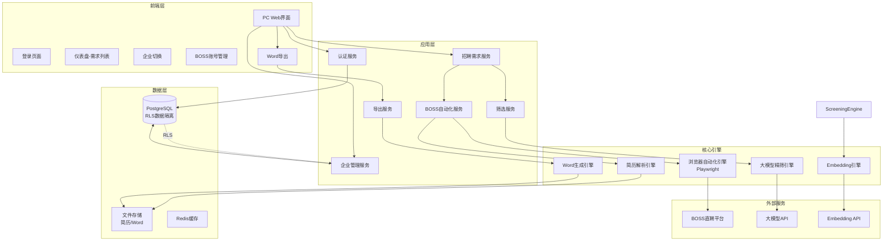
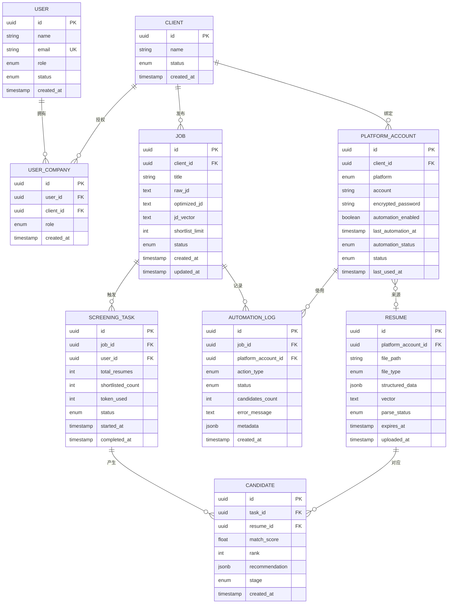
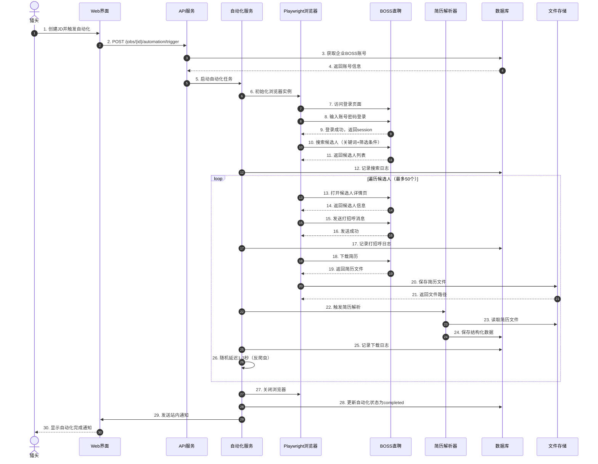
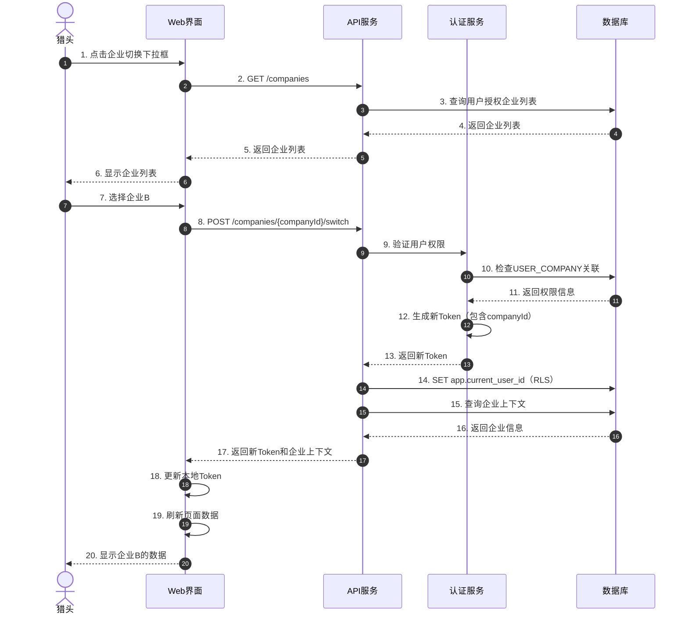
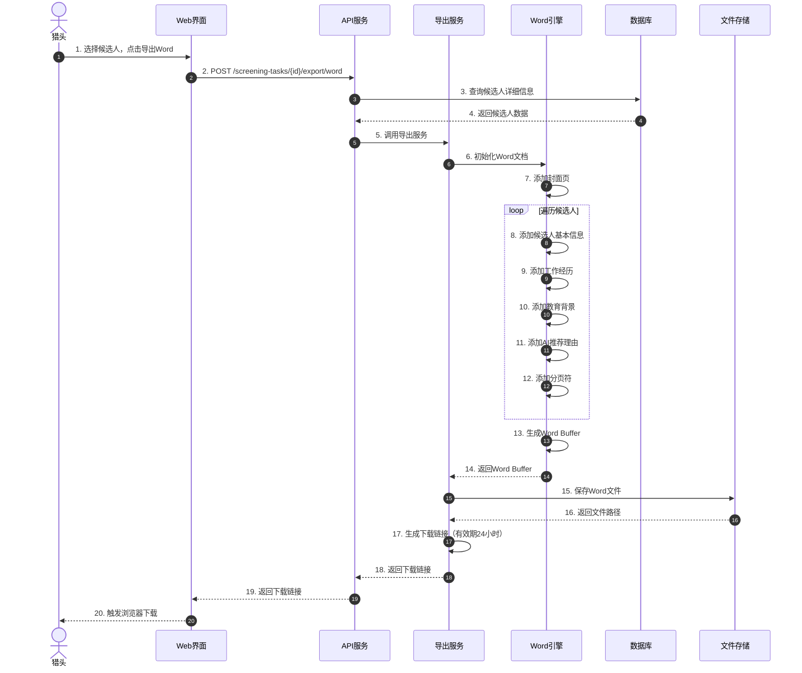

# 技术设计文档

## 文档信息

| 字段 | 值 |
|------|-----|
| **项目名称** | HR智能体 — AI驱动简历筛选系统 v2.0 |
| **设计版本** | v2.0.0 |
| **创建日期** | 2026-04-28 |
| **状态** | 草稿 |
| **基于需求** | requirements.md v2.0.0 |

---

## Overview

本设计文档基于需求变更文档v2.0.0，针对HR智能体系统的重大功能调整提供技术实现方案。核心变化包括：

1. **BOSS直聘自动化**：使用浏览器自动化技术（Playwright）实现候选人搜索、自动打招呼、简历下载
2. **Word文件导出**：替代企业微信交付，生成包含候选人信息和AI推荐理由的Word文档
3. **猎头员工管理**：支持一个猎头管理多个企业，实现数据隔离和企业切换
4. **简化架构**：删除企业微信集成、定时筛选、仪表盘统计等功能

### 设计目标

- 实现BOSS直聘自动化，50个候选人处理时间<30分钟
- Word导出响应时间<10秒
- 数据隔离准确率100%
- 自动化成功率≥80%
- 遵守BOSS直聘平台限流规则，避免账号封禁

---

## Architecture

### 系统架构图



### 技术栈选型

| 层级 | 技术选型 | 理由 |
|------|----------|------|
| 前端 | React + TypeScript | 组件化开发，类型安全 |
| 后端 | Node.js + Express | 与前端技术栈统一，生态丰富 |
| 浏览器自动化 | Playwright | 支持反爬虫对策，稳定性高 |
| 数据库 | PostgreSQL 14+ | 支持RLS行级安全，JSON字段 |
| 缓存 | Redis 7+ | 会话管理，限流控制 |
| 文件存储 | 本地文件系统/S3 | MVP使用本地，后续迁移S3 |
| Word生成 | docx.js | 纯JS实现，无需Office依赖 |
| 大模型 | OpenAI/Claude API | 已验证效果 |
| Embedding | OpenAI text-embedding-3 | 性能和成本平衡 |

---

## Components and Interfaces

### 1. BOSS直聘自动化模块

#### 1.1 BrowserAutomationService

**职责**：管理浏览器实例，执行自动化任务

```typescript
interface BrowserAutomationService {
  // 初始化浏览器实例
  initBrowser(headless: boolean): Promise<Browser>;
  
  // 登录BOSS直聘
  login(account: string, password: string): Promise<LoginResult>;
  
  // 搜索候选人
  searchCandidates(keywords: string[], filters: SearchFilters): Promise<Candidate[]>;
  
  // 发送打招呼消息
  sendGreeting(candidateId: string, message: string): Promise<GreetingResult>;
  
  // 下载简历
  downloadResume(candidateId: string): Promise<ResumeFile>;
  
  // 关闭浏览器
  closeBrowser(): Promise<void>;
}

interface SearchFilters {
  location?: string;
  experience?: string;
  education?: string;
  salary?: string;
  maxResults: number; // 默认50
}

interface LoginResult {
  success: boolean;
  sessionId?: string;
  error?: string;
}

interface GreetingResult {
  success: boolean;
  candidateId: string;
  sentAt: Date;
  error?: string;
}

interface ResumeFile {
  candidateId: string;
  filePath: string;
  fileType: 'pdf' | 'doc' | 'docx';
  downloadedAt: Date;
}
```

#### 1.2 反爬虫策略

```typescript
class AntiDetectionStrategy {
  // 随机延迟（模拟人工操作）
  async randomDelay(min: number = 1000, max: number = 3000): Promise<void> {
    const delay = Math.random() * (max - min) + min;
    await new Promise(resolve => setTimeout(resolve, delay));
  }
  
  // 模拟鼠标移动
  async simulateMouseMovement(page: Page): Promise<void> {
    const x = Math.random() * 1000;
    const y = Math.random() * 800;
    await page.mouse.move(x, y);
  }
  
  // 模拟滚动
  async simulateScroll(page: Page): Promise<void> {
    await page.evaluate(() => {
      window.scrollBy(0, Math.random() * 500);
    });
  }
  
  // 设置浏览器指纹
  async setBrowserFingerprint(page: Page): Promise<void> {
    await page.evaluateOnNewDocument(() => {
      // 覆盖webdriver标识
      Object.defineProperty(navigator, 'webdriver', {
        get: () => false,
      });
      
      // 添加Chrome插件
      Object.defineProperty(navigator, 'plugins', {
        get: () => [1, 2, 3, 4, 5],
      });
    });
  }
}
```

#### 1.3 限流控制

```typescript
class RateLimiter {
  private redis: Redis;
  
  // 检查是否超过限流
  async checkLimit(accountId: string, action: string): Promise<boolean> {
    const key = `rate_limit:${accountId}:${action}`;
    const count = await this.redis.incr(key);
    
    if (count === 1) {
      // 设置过期时间
      await this.redis.expire(key, 3600); // 1小时
    }
    
    // BOSS直聘限流规则（估算）
    const limits = {
      search: 10,      // 每小时10次搜索
      greeting: 50,    // 每小时50次打招呼
      download: 100,   // 每小时100次下载
    };
    
    return count <= limits[action];
  }
  
  // 等待限流解除
  async waitForLimit(accountId: string, action: string): Promise<void> {
    const key = `rate_limit:${accountId}:${action}`;
    const ttl = await this.redis.ttl(key);
    
    if (ttl > 0) {
      await new Promise(resolve => setTimeout(resolve, ttl * 1000));
    }
  }
}
```

### 2. Word导出模块

#### 2.1 WordExportService

```typescript
interface WordExportService {
  // 生成Word文档
  generateDocument(candidates: Candidate[], job: Job): Promise<WordDocument>;
  
  // 保存文档到文件系统
  saveDocument(doc: WordDocument, filename: string): Promise<string>;
  
  // 生成下载链接
  generateDownloadLink(filePath: string): Promise<string>;
}

interface WordDocument {
  buffer: Buffer;
  filename: string;
  size: number;
}

interface CandidateSection {
  basicInfo: {
    name: string;
    phone: string;
    email: string;
    location: string;
  };
  workExperience: WorkExperience[];
  education: Education[];
  matchAnalysis: {
    score: number;
    strengths: string[];
    matchPoints: string[];
    potentialRisks: string[];
    summary: string;
  };
}
```

#### 2.2 Word模板设计

```typescript
class WordTemplateBuilder {
  private doc: Document;
  
  constructor() {
    this.doc = new Document({
      sections: [],
    });
  }
  
  // 添加封面
  addCoverPage(jobTitle: string, companyName: string): void {
    this.doc.addSection({
      children: [
        new Paragraph({
          text: `${jobTitle} 候选人推荐`,
          heading: HeadingLevel.TITLE,
          alignment: AlignmentType.CENTER,
        }),
        new Paragraph({
          text: companyName,
          alignment: AlignmentType.CENTER,
        }),
        new Paragraph({
          text: new Date().toLocaleDateString('zh-CN'),
          alignment: AlignmentType.CENTER,
        }),
      ],
    });
  }
  
  // 添加候选人信息
  addCandidateSection(candidate: CandidateSection, rank: number): void {
    this.doc.addSection({
      children: [
        // 候选人标题
        new Paragraph({
          text: `候选人 ${rank}: ${candidate.basicInfo.name}`,
          heading: HeadingLevel.HEADING_1,
        }),
        
        // 基本信息表格
        new Table({
          rows: [
            new TableRow({
              children: [
                new TableCell({ children: [new Paragraph('姓名')] }),
                new TableCell({ children: [new Paragraph(candidate.basicInfo.name)] }),
                new TableCell({ children: [new Paragraph('电话')] }),
                new TableCell({ children: [new Paragraph(candidate.basicInfo.phone)] }),
              ],
            }),
            // ... 更多行
          ],
        }),
        
        // 工作经历
        new Paragraph({
          text: '工作经历',
          heading: HeadingLevel.HEADING_2,
        }),
        ...this.formatWorkExperience(candidate.workExperience),
        
        // AI推荐理由
        new Paragraph({
          text: 'AI推荐理由',
          heading: HeadingLevel.HEADING_2,
        }),
        new Paragraph({
          text: `匹配度: ${candidate.matchAnalysis.score * 100}%`,
          bold: true,
        }),
        new Paragraph({
          text: candidate.matchAnalysis.summary,
        }),
        
        // 优势
        new Paragraph({
          text: '核心优势:',
          bold: true,
        }),
        ...candidate.matchAnalysis.strengths.map(s => 
          new Paragraph({
            text: `• ${s}`,
            bullet: { level: 0 },
          })
        ),
        
        // 匹配点
        new Paragraph({
          text: '匹配点:',
          bold: true,
        }),
        ...candidate.matchAnalysis.matchPoints.map(m => 
          new Paragraph({
            text: `• ${m}`,
            bullet: { level: 0 },
          })
        ),
        
        // 潜在风险
        new Paragraph({
          text: '潜在风险:',
          bold: true,
        }),
        ...candidate.matchAnalysis.potentialRisks.map(r => 
          new Paragraph({
            text: `• ${r}`,
            bullet: { level: 0 },
          })
        ),
      ],
    });
  }
  
  // 生成文档
  async build(): Promise<Buffer> {
    return await Packer.toBuffer(this.doc);
  }
}
```

### 3. 猎头员工管理模块

#### 3.1 AuthenticationService

```typescript
interface AuthenticationService {
  // 猎头登录
  login(email: string, password: string): Promise<AuthResult>;
  
  // 登出
  logout(userId: string): Promise<void>;
  
  // 刷新Token
  refreshToken(refreshToken: string): Promise<AuthResult>;
  
  // 验证Token
  verifyToken(token: string): Promise<TokenPayload>;
}

interface AuthResult {
  success: boolean;
  accessToken?: string;
  refreshToken?: string;
  user?: UserProfile;
  error?: string;
}

interface UserProfile {
  id: string;
  name: string;
  email: string;
  role: 'admin' | 'consultant' | 'hr';
  companies: CompanyAccess[];
}

interface CompanyAccess {
  companyId: string;
  companyName: string;
  role: 'admin' | 'member';
}

interface TokenPayload {
  userId: string;
  email: string;
  currentCompanyId?: string;
  exp: number;
}
```

#### 3.2 CompanyManagementService

```typescript
interface CompanyManagementService {
  // 获取用户可访问的企业列表
  getUserCompanies(userId: string): Promise<Company[]>;
  
  // 切换当前企业
  switchCompany(userId: string, companyId: string): Promise<SwitchResult>;
  
  // 获取当前企业上下文
  getCurrentCompanyContext(userId: string): Promise<CompanyContext>;
  
  // 绑定BOSS直聘账号
  bindBOSSAccount(companyId: string, account: BOSSAccount): Promise<BindResult>;
  
  // 验证BOSS账号
  validateBOSSAccount(account: BOSSAccount): Promise<ValidationResult>;
}

interface Company {
  id: string;
  name: string;
  status: 'active' | 'inactive';
  bossAccountBound: boolean;
}

interface SwitchResult {
  success: boolean;
  newToken: string;
  companyContext: CompanyContext;
}

interface CompanyContext {
  companyId: string;
  companyName: string;
  bossAccount?: {
    account: string;
    status: 'active' | 'inactive' | 'expired';
    lastUsedAt?: Date;
  };
}

interface BOSSAccount {
  account: string;
  password: string;
}

interface BindResult {
  success: boolean;
  accountId?: string;
  error?: string;
}

interface ValidationResult {
  valid: boolean;
  error?: string;
}
```

#### 3.3 数据隔离实现（RLS）

```sql
-- 启用RLS
ALTER TABLE jobs ENABLE ROW LEVEL SECURITY;
ALTER TABLE screening_tasks ENABLE ROW LEVEL SECURITY;
ALTER TABLE candidates ENABLE ROW LEVEL SECURITY;
ALTER TABLE resumes ENABLE ROW LEVEL SECURITY;

-- 创建RLS策略：用户只能访问其授权企业的数据
CREATE POLICY user_company_isolation ON jobs
  USING (client_id IN (
    SELECT client_id FROM user_company 
    WHERE user_id = current_setting('app.current_user_id')::uuid
  ));

CREATE POLICY user_company_isolation ON screening_tasks
  USING (job_id IN (
    SELECT j.id FROM jobs j
    JOIN user_company uc ON j.client_id = uc.client_id
    WHERE uc.user_id = current_setting('app.current_user_id')::uuid
  ));

-- 在每个请求中设置当前用户ID
-- 应用层代码
async function setCurrentUser(userId: string): Promise<void> {
  await db.query('SET app.current_user_id = $1', [userId]);
}
```

### 4. 自动化日志模块

#### 4.1 AutomationLogService

```typescript
interface AutomationLogService {
  // 记录自动化操作
  logAction(log: AutomationLog): Promise<void>;
  
  // 查询自动化历史
  getAutomationHistory(jobId: string): Promise<AutomationLog[]>;
  
  // 获取自动化统计
  getAutomationStats(companyId: string, dateRange: DateRange): Promise<AutomationStats>;
}

interface AutomationLog {
  id?: string;
  jobId: string;
  platformAccountId: string;
  actionType: 'search' | 'greet' | 'download';
  status: 'success' | 'failed';
  candidatesCount?: number;
  errorMessage?: string;
  metadata?: Record<string, any>;
  createdAt?: Date;
}

interface AutomationStats {
  totalActions: number;
  successRate: number;
  candidatesProcessed: number;
  averageProcessingTime: number;
}
```

---

## Data Models

### 数据库Schema变更

#### 1. JOB表变更

```sql
-- 删除字段
ALTER TABLE jobs DROP COLUMN IF EXISTS contact_name;
ALTER TABLE jobs DROP COLUMN IF EXISTS contact_phone;

-- 保持其他字段不变
```

#### 2. SCREENING_TASK表变更

```sql
-- 删除字段
ALTER TABLE screening_tasks DROP COLUMN IF EXISTS trigger_type;

-- 保持其他字段不变
```

#### 3. PLATFORM_ACCOUNT表变更

```sql
-- 新增字段
ALTER TABLE platform_accounts 
ADD COLUMN automation_enabled BOOLEAN DEFAULT false,
ADD COLUMN last_automation_at TIMESTAMP,
ADD COLUMN automation_status VARCHAR(20) DEFAULT 'idle' 
  CHECK (automation_status IN ('idle', 'running', 'failed'));

-- 添加索引
CREATE INDEX idx_platform_accounts_automation_status 
ON platform_accounts(automation_status);
```

#### 4. 新增AUTOMATION_LOG表

```sql
CREATE TABLE automation_logs (
  id UUID PRIMARY KEY DEFAULT gen_random_uuid(),
  job_id UUID NOT NULL REFERENCES jobs(id) ON DELETE CASCADE,
  platform_account_id UUID NOT NULL REFERENCES platform_accounts(id) ON DELETE CASCADE,
  action_type VARCHAR(20) NOT NULL CHECK (action_type IN ('search', 'greet', 'download')),
  status VARCHAR(20) NOT NULL CHECK (status IN ('success', 'failed')),
  candidates_count INTEGER,
  error_message TEXT,
  metadata JSONB,
  created_at TIMESTAMP NOT NULL DEFAULT NOW()
);

-- 索引
CREATE INDEX idx_automation_logs_job_id ON automation_logs(job_id);
CREATE INDEX idx_automation_logs_created_at ON automation_logs(created_at DESC);
CREATE INDEX idx_automation_logs_status ON automation_logs(status);
```

### 实体关系图（更新后）



---

## API Design

### REST API规范

#### 基础配置

- **Base URL**: `https://api.hr-agent.com/v2`
- **认证方式**: JWT Bearer Token
- **Content-Type**: `application/json`
- **字符编码**: UTF-8

#### 通用响应格式

```typescript
interface APIResponse<T> {
  success: boolean;
  data?: T;
  error?: {
    code: string;
    message: string;
    details?: any;
  };
  meta?: {
    timestamp: string;
    requestId: string;
  };
}
```

### 1. 认证API

#### POST /auth/login
猎头登录

**Request:**
```json
{
  "email": "headhunter@example.com",
  "password": "encrypted_password"
}
```

**Response:**
```json
{
  "success": true,
  "data": {
    "accessToken": "eyJhbGciOiJIUzI1NiIs...",
    "refreshToken": "eyJhbGciOiJIUzI1NiIs...",
    "user": {
      "id": "uuid",
      "name": "张三",
      "email": "headhunter@example.com",
      "role": "consultant",
      "companies": [
        {
          "companyId": "uuid",
          "companyName": "科技公司A",
          "role": "admin"
        }
      ]
    }
  }
}
```

#### POST /auth/logout
猎头登出

**Request:**
```json
{
  "userId": "uuid"
}
```

**Response:**
```json
{
  "success": true
}
```

#### POST /auth/refresh
刷新Token

**Request:**
```json
{
  "refreshToken": "eyJhbGciOiJIUzI1NiIs..."
}
```

**Response:**
```json
{
  "success": true,
  "data": {
    "accessToken": "eyJhbGciOiJIUzI1NiIs...",
    "refreshToken": "eyJhbGciOiJIUzI1NiIs..."
  }
}
```

### 2. 企业管理API

#### GET /companies
获取用户可访问的企业列表

**Headers:**
```
Authorization: Bearer {accessToken}
```

**Response:**
```json
{
  "success": true,
  "data": {
    "companies": [
      {
        "id": "uuid",
        "name": "科技公司A",
        "status": "active",
        "bossAccountBound": true,
        "role": "admin"
      }
    ]
  }
}
```

#### POST /companies/{companyId}/switch
切换当前企业

**Headers:**
```
Authorization: Bearer {accessToken}
```

**Response:**
```json
{
  "success": true,
  "data": {
    "newToken": "eyJhbGciOiJIUzI1NiIs...",
    "companyContext": {
      "companyId": "uuid",
      "companyName": "科技公司A",
      "bossAccount": {
        "account": "13800138000",
        "status": "active",
        "lastUsedAt": "2026-04-28T10:00:00Z"
      }
    }
  }
}
```

### 3. BOSS直聘账号管理API

#### POST /companies/{companyId}/boss-account
绑定BOSS直聘账号

**Headers:**
```
Authorization: Bearer {accessToken}
```

**Request:**
```json
{
  "account": "13800138000",
  "password": "encrypted_password"
}
```

**Response:**
```json
{
  "success": true,
  "data": {
    "accountId": "uuid",
    "account": "13800138000",
    "status": "active"
  }
}
```

#### PUT /companies/{companyId}/boss-account/{accountId}
更新BOSS直聘账号

**Headers:**
```
Authorization: Bearer {accessToken}
```

**Request:**
```json
{
  "password": "new_encrypted_password"
}
```

**Response:**
```json
{
  "success": true,
  "data": {
    "accountId": "uuid",
    "updatedAt": "2026-04-28T10:00:00Z"
  }
}
```

#### POST /companies/{companyId}/boss-account/validate
验证BOSS直聘账号

**Headers:**
```
Authorization: Bearer {accessToken}
```

**Request:**
```json
{
  "account": "13800138000",
  "password": "encrypted_password"
}
```

**Response:**
```json
{
  "success": true,
  "data": {
    "valid": true
  }
}
```

### 4. 招聘需求API

#### POST /jobs
创建招聘需求

**Headers:**
```
Authorization: Bearer {accessToken}
X-Company-Id: {companyId}
```

**Request:**
```json
{
  "title": "高级前端工程师",
  "rawJd": "职位描述...",
  "shortlistLimit": 6
}
```

**Response:**
```json
{
  "success": true,
  "data": {
    "id": "uuid",
    "title": "高级前端工程师",
    "optimizedJd": "AI优化后的JD...",
    "status": "active",
    "createdAt": "2026-04-28T10:00:00Z"
  }
}
```

#### GET /jobs
获取招聘需求列表

**Headers:**
```
Authorization: Bearer {accessToken}
X-Company-Id: {companyId}
```

**Query Parameters:**
- `status`: active | paused | closed
- `page`: 页码（默认1）
- `pageSize`: 每页数量（默认20）

**Response:**
```json
{
  "success": true,
  "data": {
    "jobs": [
      {
        "id": "uuid",
        "title": "高级前端工程师",
        "status": "active",
        "createdAt": "2026-04-28T10:00:00Z",
        "candidatesCount": 5
      }
    ],
    "pagination": {
      "page": 1,
      "pageSize": 20,
      "total": 50
    }
  }
}
```

### 5. BOSS直聘自动化API

#### POST /jobs/{jobId}/automation/trigger
触发BOSS直聘自动化

**Headers:**
```
Authorization: Bearer {accessToken}
X-Company-Id: {companyId}
```

**Request:**
```json
{
  "keywords": ["React", "TypeScript", "前端"],
  "filters": {
    "location": "北京",
    "experience": "3-5年",
    "education": "本科",
    "maxResults": 50
  },
  "greetingMessage": "您好，我们对您的简历很感兴趣..."
}
```

**Response:**
```json
{
  "success": true,
  "data": {
    "automationId": "uuid",
    "status": "running",
    "estimatedTime": "30分钟"
  }
}
```

#### GET /jobs/{jobId}/automation/status
查询自动化状态

**Headers:**
```
Authorization: Bearer {accessToken}
X-Company-Id: {companyId}
```

**Response:**
```json
{
  "success": true,
  "data": {
    "status": "completed",
    "progress": {
      "searched": 50,
      "greeted": 48,
      "downloaded": 45,
      "failed": 2
    },
    "startedAt": "2026-04-28T10:00:00Z",
    "completedAt": "2026-04-28T10:25:00Z"
  }
}
```

#### GET /jobs/{jobId}/automation/logs
获取自动化日志

**Headers:**
```
Authorization: Bearer {accessToken}
X-Company-Id: {companyId}
```

**Query Parameters:**
- `actionType`: search | greet | download
- `status`: success | failed
- `page`: 页码
- `pageSize`: 每页数量

**Response:**
```json
{
  "success": true,
  "data": {
    "logs": [
      {
        "id": "uuid",
        "actionType": "greet",
        "status": "success",
        "candidatesCount": 1,
        "createdAt": "2026-04-28T10:05:00Z"
      }
    ],
    "pagination": {
      "page": 1,
      "pageSize": 20,
      "total": 100
    }
  }
}
```

### 6. 筛选API

#### POST /jobs/{jobId}/screening/trigger
触发手动筛选

**Headers:**
```
Authorization: Bearer {accessToken}
X-Company-Id: {companyId}
```

**Response:**
```json
{
  "success": true,
  "data": {
    "taskId": "uuid",
    "status": "running",
    "totalResumes": 45
  }
}
```

#### GET /screening-tasks/{taskId}
获取筛选任务状态

**Headers:**
```
Authorization: Bearer {accessToken}
X-Company-Id: {companyId}
```

**Response:**
```json
{
  "success": true,
  "data": {
    "id": "uuid",
    "status": "completed",
    "totalResumes": 45,
    "shortlistedCount": 6,
    "tokenUsed": 15000,
    "startedAt": "2026-04-28T10:30:00Z",
    "completedAt": "2026-04-28T10:34:00Z"
  }
}
```

#### GET /screening-tasks/{taskId}/candidates
获取筛选结果

**Headers:**
```
Authorization: Bearer {accessToken}
X-Company-Id: {companyId}
```

**Response:**
```json
{
  "success": true,
  "data": {
    "candidates": [
      {
        "id": "uuid",
        "rank": 1,
        "matchScore": 0.92,
        "basicInfo": {
          "name": "李四",
          "phone": "13900139000",
          "email": "lisi@example.com"
        },
        "recommendation": {
          "strengths": ["5年React经验", "大厂背景"],
          "matchPoints": ["技术栈完全匹配", "项目经验丰富"],
          "potentialRisks": ["期望薪资略高"],
          "summary": "该候选人技术能力强..."
        }
      }
    ]
  }
}
```

### 7. Word导出API

#### POST /screening-tasks/{taskId}/export/word
导出Word文档

**Headers:**
```
Authorization: Bearer {accessToken}
X-Company-Id: {companyId}
```

**Request:**
```json
{
  "candidateIds": ["uuid1", "uuid2", "uuid3"],
  "includeFullResume": true
}
```

**Response:**
```json
{
  "success": true,
  "data": {
    "downloadUrl": "https://api.hr-agent.com/downloads/xxx.docx",
    "filename": "高级前端工程师_候选人推荐_20260428.docx",
    "expiresAt": "2026-04-29T10:00:00Z"
  }
}
```

#### GET /downloads/{fileId}
下载Word文件

**Headers:**
```
Authorization: Bearer {accessToken}
```

**Response:**
- Content-Type: `application/vnd.openxmlformats-officedocument.wordprocessingml.document`
- Content-Disposition: `attachment; filename="xxx.docx"`

---

## Sequence Diagrams

### 1. BOSS直聘自动化完整流程



### 2. 企业切换流程



### 3. Word导出流程



---

## Error Handling

### 错误分类

| 错误类型 | HTTP状态码 | 错误代码前缀 | 处理策略 |
|----------|-----------|-------------|----------|
| 认证错误 | 401 | AUTH_xxx | 跳转登录页 |
| 权限错误 | 403 | PERM_xxx | 显示无权限提示 |
| 资源不存在 | 404 | NOT_FOUND_xxx | 显示友好提示 |
| 业务逻辑错误 | 400 | BIZ_xxx | 显示具体错误信息 |
| 限流错误 | 429 | RATE_LIMIT_xxx | 等待后重试 |
| 服务器错误 | 500 | SYS_xxx | 显示通用错误，记录日志 |
| 外部服务错误 | 502/503 | EXT_xxx | 降级处理或重试 |

### 错误代码定义

```typescript
enum ErrorCode {
  // 认证错误 (AUTH_xxx)
  AUTH_INVALID_TOKEN = 'AUTH_001',
  AUTH_TOKEN_EXPIRED = 'AUTH_002',
  AUTH_INVALID_CREDENTIALS = 'AUTH_003',
  
  // 权限错误 (PERM_xxx)
  PERM_NO_COMPANY_ACCESS = 'PERM_001',
  PERM_NO_JOB_ACCESS = 'PERM_002',
  
  // 业务逻辑错误 (BIZ_xxx)
  BIZ_BOSS_ACCOUNT_NOT_BOUND = 'BIZ_001',
  BIZ_BOSS_ACCOUNT_INVALID = 'BIZ_002',
  BIZ_AUTOMATION_ALREADY_RUNNING = 'BIZ_003',
  BIZ_NO_RESUMES_AVAILABLE = 'BIZ_004',
  BIZ_EXPORT_TOO_MANY_CANDIDATES = 'BIZ_005',
  
  // 限流错误 (RATE_LIMIT_xxx)
  RATE_LIMIT_BOSS_SEARCH = 'RATE_LIMIT_001',
  RATE_LIMIT_BOSS_GREETING = 'RATE_LIMIT_002',
  RATE_LIMIT_BOSS_DOWNLOAD = 'RATE_LIMIT_003',
  
  // 外部服务错误 (EXT_xxx)
  EXT_BOSS_LOGIN_FAILED = 'EXT_001',
  EXT_BOSS_CAPTCHA_REQUIRED = 'EXT_002',
  EXT_BOSS_ACCOUNT_BLOCKED = 'EXT_003',
  EXT_LLM_API_ERROR = 'EXT_004',
  EXT_EMBEDDING_API_ERROR = 'EXT_005',
  
  // 系统错误 (SYS_xxx)
  SYS_DATABASE_ERROR = 'SYS_001',
  SYS_FILE_STORAGE_ERROR = 'SYS_002',
  SYS_UNKNOWN_ERROR = 'SYS_999',
}
```

### 错误处理策略

#### 1. BOSS直聘自动化错误处理

```typescript
class AutomationErrorHandler {
  async handleError(error: AutomationError): Promise<ErrorHandlingResult> {
    switch (error.code) {
      case 'EXT_BOSS_LOGIN_FAILED':
        // 登录失败：标记账号状态，通知管理员
        await this.markAccountInvalid(error.accountId);
        await this.notifyAdmin(error);
        return { action: 'abort', retry: false };
      
      case 'EXT_BOSS_CAPTCHA_REQUIRED':
        // 需要验证码：暂停自动化，通知用户手动处理
        await this.pauseAutomation(error.jobId);
        await this.notifyUser(error, '需要手动完成验证码验证');
        return { action: 'pause', retry: false };
      
      case 'EXT_BOSS_ACCOUNT_BLOCKED':
        // 账号被封：标记账号，停止所有自动化
        await this.blockAccount(error.accountId);
        await this.notifyAdmin(error);
        return { action: 'abort', retry: false };
      
      case 'RATE_LIMIT_BOSS_SEARCH':
      case 'RATE_LIMIT_BOSS_GREETING':
      case 'RATE_LIMIT_BOSS_DOWNLOAD':
        // 限流：等待后重试
        const waitTime = await this.getWaitTime(error.code);
        await this.delay(waitTime);
        return { action: 'retry', retry: true, retryAfter: waitTime };
      
      case 'SYS_DATABASE_ERROR':
      case 'SYS_FILE_STORAGE_ERROR':
        // 系统错误：记录日志，重试3次
        await this.logError(error);
        if (error.retryCount < 3) {
          return { action: 'retry', retry: true, retryAfter: 5000 };
        }
        return { action: 'abort', retry: false };
      
      default:
        // 未知错误：记录日志，通知管理员
        await this.logError(error);
        await this.notifyAdmin(error);
        return { action: 'abort', retry: false };
    }
  }
}
```

#### 2. Word导出错误处理

```typescript
class ExportErrorHandler {
  async handleError(error: ExportError): Promise<void> {
    switch (error.code) {
      case 'BIZ_EXPORT_TOO_MANY_CANDIDATES':
        throw new BusinessError(
          'BIZ_005',
          '导出候选人数量不能超过10个',
          400
        );
      
      case 'SYS_FILE_STORAGE_ERROR':
        // 文件存储失败：重试3次
        if (error.retryCount < 3) {
          await this.delay(2000);
          await this.retryExport(error.taskId);
        } else {
          throw new SystemError(
            'SYS_002',
            '文件存储失败，请稍后重试',
            500
          );
        }
        break;
      
      case 'NOT_FOUND_CANDIDATES':
        throw new BusinessError(
          'NOT_FOUND_001',
          '未找到候选人数据',
          404
        );
      
      default:
        throw new SystemError(
          'SYS_999',
          '导出失败，请联系管理员',
          500
        );
    }
  }
}
```

#### 3. 数据隔离错误处理

```typescript
class DataIsolationErrorHandler {
  async handleError(error: DataAccessError): Promise<void> {
    switch (error.code) {
      case 'PERM_NO_COMPANY_ACCESS':
        throw new PermissionError(
          'PERM_001',
          '您没有访问该企业数据的权限',
          403
        );
      
      case 'PERM_NO_JOB_ACCESS':
        throw new PermissionError(
          'PERM_002',
          '您没有访问该招聘需求的权限',
          403
        );
      
      case 'AUTH_INVALID_TOKEN':
        // Token无效：清除本地Token，跳转登录
        await this.clearLocalToken();
        await this.redirectToLogin();
        break;
      
      case 'AUTH_TOKEN_EXPIRED':
        // Token过期：尝试刷新Token
        try {
          await this.refreshToken();
          await this.retryRequest();
        } catch (refreshError) {
          await this.redirectToLogin();
        }
        break;
      
      default:
        throw new SystemError(
          'SYS_999',
          '数据访问失败',
          500
        );
    }
  }
}
```

### 错误日志记录

```typescript
interface ErrorLog {
  id: string;
  errorCode: string;
  errorMessage: string;
  stackTrace?: string;
  context: {
    userId?: string;
    companyId?: string;
    jobId?: string;
    requestId: string;
    endpoint: string;
    method: string;
  };
  severity: 'low' | 'medium' | 'high' | 'critical';
  timestamp: Date;
}

class ErrorLogger {
  async log(error: Error, context: any): Promise<void> {
    const errorLog: ErrorLog = {
      id: generateUUID(),
      errorCode: error.code || 'SYS_999',
      errorMessage: error.message,
      stackTrace: error.stack,
      context: {
        userId: context.userId,
        companyId: context.companyId,
        jobId: context.jobId,
        requestId: context.requestId,
        endpoint: context.endpoint,
        method: context.method,
      },
      severity: this.determineSeverity(error),
      timestamp: new Date(),
    };
    
    // 写入数据库
    await db.errorLogs.insert(errorLog);
    
    // 高严重性错误发送告警
    if (errorLog.severity === 'high' || errorLog.severity === 'critical') {
      await this.sendAlert(errorLog);
    }
  }
  
  private determineSeverity(error: Error): string {
    if (error.code?.startsWith('EXT_BOSS_ACCOUNT')) {
      return 'critical'; // 账号问题影响业务
    }
    if (error.code?.startsWith('SYS_')) {
      return 'high'; // 系统错误
    }
    if (error.code?.startsWith('RATE_LIMIT_')) {
      return 'medium'; // 限流可恢复
    }
    return 'low';
  }
}
```

---

## Testing Strategy

### PBT Applicability Assessment

**结论：本功能不适合使用Property-Based Testing**

**理由：**

1. **BOSS直聘自动化**：
   - 涉及浏览器自动化和外部服务交互
   - 大量副作用操作（登录、搜索、发送消息、下载文件）
   - 行为不是纯函数，无法通过输入变化验证通用属性
   - 属于"副作用操作"和"外部服务交互"类别

2. **Word文件导出**：
   - 主要是文档格式化和生成
   - 输出是二进制文件，难以定义通用属性
   - 属于"UI渲染/格式化输出"类别

3. **猎头员工管理**：
   - 简单的CRUD操作
   - 数据库读写操作
   - 属于"简单CRUD"类别

4. **数据隔离（RLS）**：
   - 权限控制和配置验证
   - 属于"配置验证"类别

**替代测试策略：**
- 单元测试（mock-based）：测试业务逻辑
- 集成测试：测试外部服务交互
- 端到端测试：测试完整业务流程
- 安全测试：验证数据隔离

### 测试覆盖率目标

| 测试类型 | 覆盖率目标 | 测量指标 |
|----------|-----------|----------|
| 单元测试 | ≥80% | 行覆盖率 |
| 集成测试 | ≥70% | API端点覆盖 |
| E2E测试 | 100% | 核心业务流程 |
| 安全测试 | 100% | 数据隔离场景 |

---

## Deployment Architecture

### 部署架构图

\`\`\`mermaid
graph TB
    subgraph "负载均衡层"
        LB[Nginx负载均衡器]
    end
    
    subgraph "应用层"
        APP1[Node.js应用实例1]
        APP2[Node.js应用实例2]
        APP3[Node.js应用实例3]
    end
    
    subgraph "浏览器自动化层"
        Browser1[Playwright实例1]
        Browser2[Playwright实例2]
    end
    
    subgraph "数据层"
        PG[(PostgreSQL主库)]
        PG_Replica[(PostgreSQL从库)]
        Redis[(Redis集群)]
    end
    
    subgraph "存储层"
        S3[文件存储<br/>S3/本地]
    end
    
    subgraph "外部服务"
        BOSS[BOSS直聘]
        LLM[大模型API]
        Embedding[Embedding API]
    end
    
    LB --> APP1
    LB --> APP2
    LB --> APP3
    
    APP1 --> Browser1
    APP2 --> Browser2
    APP3 --> Browser1
    
    APP1 --> PG
    APP2 --> PG
    APP3 --> PG
    
    APP1 --> PG_Replica
    APP2 --> PG_Replica
    APP3 --> PG_Replica
    
    APP1 --> Redis
    APP2 --> Redis
    APP3 --> Redis
    
    APP1 --> S3
    APP2 --> S3
    APP3 --> S3
    
    Browser1 --> BOSS
    Browser2 --> BOSS
    
    APP1 --> LLM
    APP2 --> LLM
    APP3 --> LLM
    
    APP1 --> Embedding
    APP2 --> Embedding
    APP3 --> Embedding
\`\`\`

### 环境配置

#### 开发环境

\`\`\`yaml
environment: development
database:
  host: localhost
  port: 5432
  database: hr_agent_dev
  pool_size: 10
redis:
  host: localhost
  port: 6379
storage:
  type: local
  path: ./uploads
browser:
  headless: false
  instances: 1
\`\`\`

#### 生产环境

\`\`\`yaml
environment: production
database:
  host: pg-primary.internal
  port: 5432
  database: hr_agent_prod
  pool_size: 50
  replica:
    host: pg-replica.internal
    port: 5432
redis:
  cluster:
    - redis-1.internal:6379
    - redis-2.internal:6379
    - redis-3.internal:6379
storage:
  type: s3
  bucket: hr-agent-files
  region: cn-north-1
browser:
  headless: true
  instances: 5
  max_concurrent: 10
\`\`\`

---

## Performance Optimization

### 1. BOSS自动化性能优化

#### 并发控制

\`\`\`typescript
class ConcurrencyController {
  private maxConcurrent: number = 5;
  private running: number = 0;
  private queue: Array<() => Promise<any>> = [];
  
  async execute<T>(task: () => Promise<T>): Promise<T> {
    if (this.running >= this.maxConcurrent) {
      await new Promise(resolve => this.queue.push(resolve));
    }
    
    this.running++;
    try {
      return await task();
    } finally {
      this.running--;
      const next = this.queue.shift();
      if (next) next();
    }
  }
}
\`\`\`

#### 浏览器实例池

\`\`\`typescript
class BrowserPool {
  private pool: Browser[] = [];
  private maxSize: number = 5;
  
  async acquire(): Promise<Browser> {
    if (this.pool.length > 0) {
      return this.pool.pop()!;
    }
    
    if (this.pool.length < this.maxSize) {
      return await chromium.launch({ headless: true });
    }
    
    // 等待可用实例
    await new Promise(resolve => setTimeout(resolve, 1000));
    return this.acquire();
  }
  
  async release(browser: Browser): Promise<void> {
    if (this.pool.length < this.maxSize) {
      this.pool.push(browser);
    } else {
      await browser.close();
    }
  }
}
\`\`\`

### 2. 数据库查询优化

#### 索引策略

\`\`\`sql
-- 自动化日志查询优化
CREATE INDEX idx_automation_logs_job_created 
ON automation_logs(job_id, created_at DESC);

-- 候选人查询优化
CREATE INDEX idx_candidates_task_rank 
ON candidates(task_id, rank);

-- 简历查询优化
CREATE INDEX idx_resumes_platform_account 
ON resumes(platform_account_id, uploaded_at DESC);

-- 用户企业关联查询优化
CREATE INDEX idx_user_company_user_client 
ON user_company(user_id, client_id);
\`\`\`

#### 查询优化

\`\`\`typescript
// 使用连接池
const pool = new Pool({
  max: 50,
  idleTimeoutMillis: 30000,
  connectionTimeoutMillis: 2000,
});

// 批量插入优化
async function batchInsertResumes(resumes: Resume[]): Promise<void> {
  const values = resumes.map((r, i) => 
    \`($\${i*6+1}, $\${i*6+2}, $\${i*6+3}, $\${i*6+4}, $\${i*6+5}, $\${i*6+6})\`
  ).join(',');
  
  const params = resumes.flatMap(r => [
    r.id, r.platformAccountId, r.filePath, 
    r.fileType, r.structuredData, r.uploadedAt
  ]);
  
  await pool.query(\`
    INSERT INTO resumes (id, platform_account_id, file_path, file_type, structured_data, uploaded_at)
    VALUES \${values}
  \`, params);
}
\`\`\`

### 3. 缓存策略

\`\`\`typescript
class CacheService {
  private redis: Redis;
  
  // 缓存企业信息（1小时）
  async getCompany(companyId: string): Promise<Company> {
    const cached = await this.redis.get(\`company:\${companyId}\`);
    if (cached) return JSON.parse(cached);
    
    const company = await db.clients.findById(companyId);
    await this.redis.setex(\`company:\${companyId}\`, 3600, JSON.stringify(company));
    return company;
  }
  
  // 缓存用户权限（30分钟）
  async getUserCompanies(userId: string): Promise<Company[]> {
    const cached = await this.redis.get(\`user_companies:\${userId}\`);
    if (cached) return JSON.parse(cached);
    
    const companies = await db.userCompany.findByUserId(userId);
    await this.redis.setex(\`user_companies:\${userId}\`, 1800, JSON.stringify(companies));
    return companies;
  }
  
  // 清除缓存
  async invalidateUserCache(userId: string): Promise<void> {
    await this.redis.del(\`user_companies:\${userId}\`);
  }
}
\`\`\`

---

## Monitoring and Observability

### 监控指标

| 指标类别 | 指标名称 | 目标值 | 告警阈值 |
|----------|----------|--------|----------|
| 性能 | BOSS自动化耗时 | <30分钟/50人 | >45分钟 |
| 性能 | Word导出耗时 | <10秒 | >15秒 |
| 性能 | API响应时间P95 | <500ms | >1000ms |
| 可用性 | 系统可用率 | ≥99.5% | <99% |
| 业务 | 自动化成功率 | ≥80% | <70% |
| 业务 | 简历解析成功率 | ≥95% | <90% |
| 资源 | CPU使用率 | <70% | >85% |
| 资源 | 内存使用率 | <80% | >90% |
| 资源 | 数据库连接数 | <80% | >90% |

### 日志规范

\`\`\`typescript
interface LogEntry {
  timestamp: string;
  level: 'debug' | 'info' | 'warn' | 'error';
  service: string;
  traceId: string;
  userId?: string;
  companyId?: string;
  message: string;
  metadata?: Record<string, any>;
}

// 结构化日志
logger.info('BOSS automation started', {
  jobId: 'xxx',
  companyId: 'yyy',
  maxCandidates: 50,
});

logger.error('BOSS automation failed', {
  jobId: 'xxx',
  error: error.message,
  stack: error.stack,
});
\`\`\`

---

## Security Considerations

### 1. 密码加密

\`\`\`typescript
import crypto from 'crypto';

class EncryptionService {
  private algorithm = 'aes-256-gcm';
  private key: Buffer;
  
  constructor(secretKey: string) {
    this.key = crypto.scryptSync(secretKey, 'salt', 32);
  }
  
  encrypt(plaintext: string): string {
    const iv = crypto.randomBytes(16);
    const cipher = crypto.createCipheriv(this.algorithm, this.key, iv);
    
    let encrypted = cipher.update(plaintext, 'utf8', 'hex');
    encrypted += cipher.final('hex');
    
    const authTag = cipher.getAuthTag();
    
    return \`\${iv.toString('hex')}:\${authTag.toString('hex')}:\${encrypted}\`;
  }
  
  decrypt(ciphertext: string): string {
    const [ivHex, authTagHex, encrypted] = ciphertext.split(':');
    
    const iv = Buffer.from(ivHex, 'hex');
    const authTag = Buffer.from(authTagHex, 'hex');
    
    const decipher = crypto.createDecipheriv(this.algorithm, this.key, iv);
    decipher.setAuthTag(authTag);
    
    let decrypted = decipher.update(encrypted, 'hex', 'utf8');
    decrypted += decipher.final('utf8');
    
    return decrypted;
  }
}
\`\`\`

### 2. JWT Token安全

\`\`\`typescript
interface TokenPayload {
  userId: string;
  email: string;
  currentCompanyId?: string;
  iat: number;
  exp: number;
}

class TokenService {
  private secret: string;
  
  generateAccessToken(payload: Omit<TokenPayload, 'iat' | 'exp'>): string {
    return jwt.sign(payload, this.secret, {
      expiresIn: '1h',
      algorithm: 'HS256',
    });
  }
  
  generateRefreshToken(userId: string): string {
    return jwt.sign({ userId }, this.secret, {
      expiresIn: '7d',
      algorithm: 'HS256',
    });
  }
  
  verifyToken(token: string): TokenPayload {
    try {
      return jwt.verify(token, this.secret) as TokenPayload;
    } catch (error) {
      if (error.name === 'TokenExpiredError') {
        throw new AuthError('AUTH_002', 'Token已过期');
      }
      throw new AuthError('AUTH_001', 'Token无效');
    }
  }
}
\`\`\`

### 3. API限流

\`\`\`typescript
class RateLimiter {
  private redis: Redis;
  
  async checkLimit(
    key: string,
    limit: number,
    window: number
  ): Promise<boolean> {
    const current = await this.redis.incr(key);
    
    if (current === 1) {
      await this.redis.expire(key, window);
    }
    
    return current <= limit;
  }
  
  // API限流中间件
  apiRateLimit(limit: number = 100, window: number = 60) {
    return async (req, res, next) => {
      const key = \`rate_limit:api:\${req.userId}:\${Math.floor(Date.now() / (window * 1000))}\`;
      
      const allowed = await this.checkLimit(key, limit, window);
      
      if (!allowed) {
        return res.status(429).json({
          success: false,
          error: {
            code: 'RATE_LIMIT_API',
            message: '请求过于频繁，请稍后再试',
          },
        });
      }
      
      next();
    };
  }
}
\`\`\`

---

## Migration Plan

### 数据库迁移脚本

\`\`\`sql
-- Migration: v2.0.0 - BOSS自动化和Word导出
-- Date: 2026-04-28

BEGIN;

-- 1. 删除JOB表字段
ALTER TABLE jobs DROP COLUMN IF EXISTS contact_name;
ALTER TABLE jobs DROP COLUMN IF EXISTS contact_phone;

-- 2. 删除SCREENING_TASK表字段
ALTER TABLE screening_tasks DROP COLUMN IF EXISTS trigger_type;

-- 3. 更新PLATFORM_ACCOUNT表
ALTER TABLE platform_accounts 
ADD COLUMN IF NOT EXISTS automation_enabled BOOLEAN DEFAULT false,
ADD COLUMN IF NOT EXISTS last_automation_at TIMESTAMP,
ADD COLUMN IF NOT EXISTS automation_status VARCHAR(20) DEFAULT 'idle' 
  CHECK (automation_status IN ('idle', 'running', 'failed'));

-- 4. 创建AUTOMATION_LOG表
CREATE TABLE IF NOT EXISTS automation_logs (
  id UUID PRIMARY KEY DEFAULT gen_random_uuid(),
  job_id UUID NOT NULL REFERENCES jobs(id) ON DELETE CASCADE,
  platform_account_id UUID NOT NULL REFERENCES platform_accounts(id) ON DELETE CASCADE,
  action_type VARCHAR(20) NOT NULL CHECK (action_type IN ('search', 'greet', 'download')),
  status VARCHAR(20) NOT NULL CHECK (status IN ('success', 'failed')),
  candidates_count INTEGER,
  error_message TEXT,
  metadata JSONB,
  created_at TIMESTAMP NOT NULL DEFAULT NOW()
);

-- 5. 创建索引
CREATE INDEX IF NOT EXISTS idx_platform_accounts_automation_status 
ON platform_accounts(automation_status);

CREATE INDEX IF NOT EXISTS idx_automation_logs_job_id 
ON automation_logs(job_id);

CREATE INDEX IF NOT EXISTS idx_automation_logs_created_at 
ON automation_logs(created_at DESC);

CREATE INDEX IF NOT EXISTS idx_automation_logs_status 
ON automation_logs(status);

CREATE INDEX IF NOT EXISTS idx_automation_logs_job_created 
ON automation_logs(job_id, created_at DESC);

-- 6. 更新RLS策略
DROP POLICY IF EXISTS user_company_isolation ON automation_logs;

CREATE POLICY user_company_isolation ON automation_logs
  USING (job_id IN (
    SELECT j.id FROM jobs j
    JOIN user_company uc ON j.client_id = uc.client_id
    WHERE uc.user_id = current_setting('app.current_user_id')::uuid
  ));

ALTER TABLE automation_logs ENABLE ROW LEVEL SECURITY;

COMMIT;
\`\`\`

### 部署步骤

1. **数据库迁移**
   \`\`\`bash
   npm run migrate:up
   \`\`\`

2. **部署后端服务**
   \`\`\`bash
   # 构建
   npm run build
   
   # 部署（滚动更新）
   kubectl apply -f k8s/deployment.yaml
   \`\`\`

3. **部署前端**
   \`\`\`bash
   npm run build:frontend
   aws s3 sync dist/ s3://hr-agent-frontend/
   \`\`\`

4. **验证部署**
   \`\`\`bash
   npm run test:smoke
   \`\`\`

---

## Appendix

### A. 技术债务

| ID | 描述 | 优先级 | 计划解决版本 |
|----|------|--------|-------------|
| TD-001 | 浏览器实例池需要优化资源释放 | P2 | v2.1 |
| TD-002 | Word导出模板需要支持自定义 | P3 | v2.2 |
| TD-003 | 自动化日志需要增加更详细的元数据 | P3 | v2.1 |

### B. 未来优化方向

1. **多平台支持**：扩展到猎聘、拉钩等平台
2. **AI优化**：优化打招呼消息的个性化生成
3. **数据分析**：增加自动化效果分析和优化建议
4. **移动端**：开发移动端应用

---

**文档结束** | 版本 v2.0.0 | 2026-04-28
