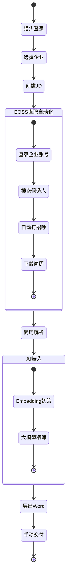

# 需求变更文档

## 文档信息

| 字段 | 值 |
|------|-----|
| **项目名称** | HR智能体 — AI驱动简历筛选系统 |
| **变更类型** | 重大功能调整 |
| **版本** | v2.0.0 |
| **创建日期** | 2026-04-28 |
| **状态** | 草稿 |
| **基于版本** | v1.0.0 |

## 术语表

- **System**: HR智能体系统
- **Headhunter**: 猎头员工
- **Company**: 企业客户
- **BOSS_Platform**: BOSS直聘招聘平台
- **JD**: 招聘需求(Job Description)
- **Resume**: 候选人简历
- **Screening_Engine**: AI筛选引擎
- **Export_Module**: 导出模块
- **Automation_Service**: BOSS直聘自动化服务

---

## 变更概述

本次变更基于原型评审反馈,对HR智能体系统进行重大功能调整。核心变化包括:删除企业微信自动交付、简化仪表盘统计、调整简历获取方式为BOSS直聘自动化、新增猎头员工管理和企业账号管理功能。

---

## 需求变更清单

### 删减功能

#### 需求 1: 删除企业微信自动交付功能

**用户故事**: 作为产品负责人,我希望删除企业微信自动交付功能,以便简化MVP范围并降低集成复杂度。

##### 验收标准

1. THE System SHALL remove all WeChat Work integration code
2. THE System SHALL remove REQ-009 from requirements documentation
3. THE System SHALL update data model to remove WeChat-related fields
4. THE System SHALL update user stories to remove US-012

---

#### 需求 2: 删除定时筛选功能

**用户故事**: 作为产品负责人,我希望删除定时筛选场景,以便降低系统复杂性并聚焦核心手动筛选流程。

##### 验收标准

1. THE System SHALL remove scheduled screening trigger from SCREENING_TASK
2. THE System SHALL update US-009 to remove scheduled scenario
3. THE System SHALL remove trigger_type field from SCREENING_TASK entity
4. WHEN Headhunter initiates screening, THE System SHALL only support manual trigger mode

---

#### 需求 3: 删除仪表盘统计卡片

**用户故事**: 作为猎头员工,我希望仪表盘只显示需求列表,以便快速进入核心工作流程而不被统计数据干扰。

##### 验收标准

1. THE System SHALL remove four statistical cards from dashboard
2. THE System SHALL retain job requirements list on dashboard
3. THE System SHALL update UI prototype to reflect simplified dashboard
4. WHEN Headhunter accesses dashboard, THE System SHALL display job list within 2 seconds

---

#### 需求 4: 删除招聘需求的甲方联系人字段

**用户故事**: 作为数据架构师,我希望从JOB实体删除contact_name和contact_phone字段,以便简化数据模型并避免冗余存储。

##### 验收标准

1. THE System SHALL remove contact_name field from JOB entity
2. THE System SHALL remove contact_phone field from JOB entity
3. THE System SHALL update data-model.md to reflect entity changes
4. THE System SHALL migrate existing data before schema change

---

#### 需求 5: 删除推荐理由人工编辑功能

**用户故事**: 作为猎头员工,我希望AI直接生成推荐理由而无需人工编辑,以便加快交付速度并减少操作步骤。

##### 验收标准

1. THE System SHALL remove recommendation editing UI
2. THE System SHALL generate final recommendation text via AI
3. WHEN AI generates recommendation, THE System SHALL not provide manual editing interface
4. THE System SHALL update US-010 to remove editing capability

---

#### 需求 6: 删除交付记录统计功能

**用户故事**: 作为产品负责人,我希望删除交付相关统计功能,以便简化MVP范围并聚焦核心筛选流程。

##### 验收标准

1. THE System SHALL remove delivery statistics from system
2. THE System SHALL remove delivery-related metrics from monitoring
3. THE System SHALL update requirements to remove delivery tracking features
4. THE System SHALL retain basic screening task records

---

### 调整功能

#### 需求 7: 调整筛选结果导出为Word文件

**用户故事**: 作为猎头员工,我希望将筛选结果导出为Word文件,以便手动交付给甲方企业并保持交付灵活性。

##### 验收标准

1. WHEN Headhunter completes screening, THE System SHALL provide Word export function
2. THE Export_Module SHALL generate Word document containing candidate information
3. THE Export_Module SHALL include AI-generated recommendation text in Word document
4. THE Word document SHALL contain candidate basic info, work experience, and match analysis
5. WHEN export completes, THE System SHALL provide download link within 10 seconds
6. THE System SHALL support exporting 1-10 candidates in single Word file

---

#### 需求 8: 调整简历获取方式为BOSS直聘自动化

**用户故事**: 作为猎头员工,我希望系统通过BOSS直聘企业账号自动获取简历,以便减少手动上传工作并提高简历获取效率。

##### 验收标准

1. WHEN Headhunter creates JD, THE System SHALL use Company's BOSS_Platform account
2. THE Automation_Service SHALL automatically search candidates on BOSS_Platform
3. THE Automation_Service SHALL automatically send greetings to matched candidates
4. THE Automation_Service SHALL automatically download resumes to resume library
5. WHEN automation completes, THE System SHALL notify Headhunter via in-app message
6. THE System SHALL log all automation actions for audit purposes

---

### 新增功能

#### 需求 9: 新增猎头员工管理功能

**用户故事**: 作为系统管理员,我希望管理多个猎头员工账号,以便支持团队协作并实现多员工多企业的业务模式。

##### 验收标准

1. THE System SHALL provide employee management interface
2. THE System SHALL support creating Headhunter accounts with email and password
3. THE System SHALL allow one Headhunter to manage multiple Companies
4. WHEN Headhunter logs in, THE System SHALL display list of authorized Companies
5. THE System SHALL enforce data isolation between different Companies
6. THE System SHALL use row-level security (RLS) to prevent cross-company data access

---

#### 需求 10: 新增企业BOSS直聘账号管理功能

**用户故事**: 作为系统管理员,我希望为每个企业绑定BOSS直聘账号,以便系统能够使用企业账号进行自动化操作。

##### 验收标准

1. THE System SHALL provide Company-level BOSS_Platform account configuration
2. THE System SHALL store BOSS_Platform account credentials using AES-256 encryption
3. WHEN administrator configures account, THE System SHALL validate credentials via test login
4. THE System SHALL support one BOSS_Platform account per Company
5. THE System SHALL display account binding status on Company management page
6. IF account credentials are invalid, THEN THE System SHALL alert administrator

---

#### 需求 11: 新增BOSS直聘自动化功能

**用户故事**: 作为猎头员工,我希望系统自动在BOSS直聘搜索候选人、打招呼并下载简历,以便大幅减少手动操作时间并提高工作效率。

##### 验收标准

1. WHEN Headhunter triggers automation, THE System SHALL login to BOSS_Platform using Company account
2. THE Automation_Service SHALL search candidates based on JD keywords
3. THE Automation_Service SHALL automatically send greeting messages to Top 50 candidates
4. THE Automation_Service SHALL download candidate resumes to System resume library
5. THE Automation_Service SHALL parse downloaded resumes automatically
6. WHEN automation encounters errors, THE System SHALL log error details and notify Headhunter
7. THE System SHALL complete automation for 50 candidates within 30 minutes
8. THE System SHALL respect BOSS_Platform rate limits to avoid account blocking

---

## 新的核心业务流程

### 流程描述

```
1. 猎头登录系统
2. 选择/切换企业(一个猎头管理多个企业)
3. 为企业创建JD招聘需求
4. 系统使用该企业的BOSS直聘账号登录
5. 自动在BOSS直聘搜索候选人
6. 自动打招呼
7. 自动下载简历到简历库
8. 执行AI筛选(embedding初筛 + 大模型精筛)
9. 导出Word文件(含候选人信息和AI推荐理由)
10. 猎头手动交付给甲方企业
```

### 流程图



---

## 受影响的现有需求

### 删除的需求

| 需求ID | 需求描述 | 影响 |
|--------|----------|------|
| REQ-009 | 企业微信自动交付 | 完全删除 |
| US-009定时场景 | 定时筛选触发 | 从US-009删除定时场景 |

### 调整的需求

| 需求ID | 原描述 | 新描述 | 影响 |
|--------|--------|--------|------|
| REQ-007-1 | 用户-公司权限管理 | 猎头员工-企业多对多管理 | 强化多对多关系 |
| REQ-007-2 | BOSS直聘账号绑定 | 企业BOSS直聘账号管理+自动化 | 扩展为自动化功能 |
| REQ-005-1 | BOSS直聘API对接 | BOSS直聘自动化操作 | 从API对接升级为自动化 |

### 保留的需求

| 需求ID | 需求描述 | 状态 |
|--------|----------|------|
| REQ-001 | 多格式简历解析与结构化 | 保留 |
| REQ-002 | JD语义匹配评分 | 保留(仅手动触发) |
| REQ-003 | 大模型二次精筛+推荐理由 | 保留 |
| REQ-004 | 从简历反向生成JD | 保留 |
| REQ-008 | PC端基础UI与交互 | 保留(简化仪表盘) |
| REQ-010 | 多客户多需求管理 | 保留 |
| REQ-011 | AI辅助优化JD | 保留 |

---

## 数据模型变更

### 实体变更

#### JOB实体变更

**删除字段**:
- contact_name
- contact_phone

**保留字段**: 所有其他字段保持不变

#### SCREENING_TASK实体变更

**删除字段**:
- trigger_type (删除定时触发)

**保留字段**: 所有其他字段保持不变

#### USER_COMPANY实体

**状态**: 保留并强化,支持一个猎头管理多个企业

#### PLATFORM_ACCOUNT实体变更

**新增字段**:
- automation_enabled (boolean): 是否启用自动化
- last_automation_at (datetime): 最后一次自动化时间
- automation_status (enum): 自动化状态 (idle/running/failed)

**保留字段**: 所有其他字段保持不变

### 新增实体

#### AUTOMATION_LOG (自动化日志)

| 属性 | 类型 | 必填 | 描述 |
|------|------|------|------|
| id | string | 是 | 主键 |
| job_id | string | 是 | 关联的招聘需求 |
| platform_account_id | string | 是 | 使用的平台账号 |
| action_type | enum | 是 | 操作类型(search/greet/download) |
| status | enum | 是 | 状态(success/failed) |
| candidates_count | int | 否 | 处理的候选人数量 |
| error_message | text | 否 | 错误信息 |
| created_at | datetime | 是 | 创建时间 |

---

## 业务规则变更

### 新增业务规则

| 规则ID | 规则描述 | 来源 |
|--------|----------|------|
| BR-010 | 每个企业只能绑定一个BOSS直聘账号 | 需求10 |
| BR-011 | 猎头切换企业后,所有数据按当前企业隔离显示 | 需求9 |
| BR-012 | BOSS直聘自动化每次最多处理50个候选人 | 需求11 |
| BR-013 | 自动化操作需遵守BOSS直聘平台限流规则 | 需求11 |
| BR-014 | Word导出文件包含1-10个候选人信息 | 需求7 |

### 删除的业务规则

| 规则ID | 规则描述 | 原因 |
|--------|----------|------|
| BR-004 | 企业微信推送格式规则 | 删除企业微信功能 |
| BR-005 | 定时筛选通知规则 | 删除定时筛选功能 |

---

## 非功能性需求变更

### 性能需求

| ID | 需求 | 指标 | 目标 |
|----|------|------|------|
| NFR-P05 | BOSS直聘自动化响应 | 50个候选人处理时间 | <30分钟 |
| NFR-P06 | Word文件导出 | 导出响应时间 | <10秒 |

### 安全需求

| ID | 需求 | 指标 | 目标 |
|----|------|------|------|
| NFR-S05 | BOSS直聘账号安全 | 密码加密 | AES-256加密存储 |
| NFR-S06 | 自动化操作审计 | 日志记录 | 所有自动化操作必须记录日志 |

---

## 风险评估

| 风险ID | 风险描述 | 概率 | 影响 | 缓解策略 |
|--------|----------|------|------|----------|
| RISK-NEW-001 | BOSS直聘反爬虫机制可能阻止自动化 | 高 | 高 | 使用浏览器自动化+人工行为模拟 |
| RISK-NEW-002 | BOSS直聘账号可能被封禁 | 中 | 高 | 遵守平台限流规则,记录操作日志 |
| RISK-NEW-003 | 自动化失败率可能较高 | 中 | 中 | 提供详细错误日志和重试机制 |
| RISK-NEW-004 | Word导出格式兼容性问题 | 低 | 中 | 使用标准docx格式,测试多版本兼容 |

---

## 实施优先级

### 第一阶段 (删减功能)

1. 删除企业微信自动交付 (需求1)
2. 删除定时筛选功能 (需求2)
3. 删除仪表盘统计卡片 (需求3)
4. 删除招聘需求联系人字段 (需求4)
5. 删除推荐理由编辑功能 (需求5)
6. 删除交付记录统计 (需求6)

### 第二阶段 (调整功能)

1. 实现Word文件导出 (需求7)
2. 调整简历获取流程 (需求8)

### 第三阶段 (新增功能)

1. 实现猎头员工管理 (需求9)
2. 实现企业BOSS直聘账号管理 (需求10)
3. 实现BOSS直聘自动化 (需求11)

---

## 验收标准

### 整体验收标准

1. 所有删减功能已从代码和文档中移除
2. Word导出功能正常工作,格式符合要求
3. 猎头可以管理多个企业并切换
4. 每个企业可以绑定BOSS直聘账号
5. BOSS直聘自动化功能可以搜索、打招呼、下载简历
6. 数据隔离机制正常工作,无跨企业数据泄露
7. 所有自动化操作有完整日志记录

### 成功指标

| 指标 | 目标值 | 测量方式 |
|------|--------|----------|
| BOSS直聘自动化成功率 | ≥80% | 监控日志统计 |
| Word导出成功率 | ≥99% | 监控日志统计 |
| 自动化处理50个候选人耗时 | <30分钟 | 性能测试 |
| 数据隔离准确率 | 100% | 安全测试 |

---

## 变更影响分析

### 代码影响

- 删除企业微信集成代码
- 删除定时任务调度代码
- 删除仪表盘统计组件
- 新增Word导出模块
- 新增BOSS直聘自动化模块
- 新增猎头员工管理模块
- 调整数据访问层以支持RLS

### 文档影响

- 更新requirements.md
- 更新data-model.md
- 更新prd.md
- 更新rtm.md
- 更新UI原型

### 测试影响

- 删除企业微信集成测试
- 删除定时任务测试
- 新增Word导出测试
- 新增BOSS直聘自动化测试
- 新增数据隔离测试
- 新增多企业切换测试

---

## 下一步行动

1. 产品负责人审批本需求变更文档
2. 技术负责人评估技术可行性
3. 更新项目计划和时间表
4. 开始第一阶段实施(删减功能)
5. 进行BOSS直聘自动化技术POC

---

**文档结束** | 版本 v2.0.0 | 2026-04-28
